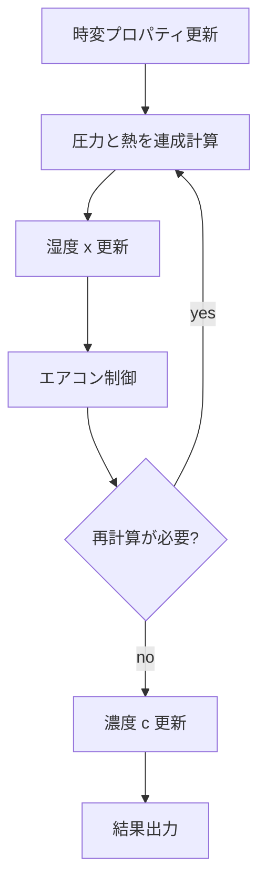

### エアコン制御の概要

このドキュメントは、solver 側のエアコン制御が

- どのノード/ブランチを使うか
- 1 タイムステップの中でいつ動くか
- ON/OFF 判定をどうしているか
- 処理熱量・能力上限をどう扱うか

をまとめたものです。

主な実装箇所:

- `solver/aircon/aircon_controller.cpp`
- `solver/simulation_runner.cpp`
- `solver/core/thermal/thermal_direct_build.cpp`
- `solver/core/thermal/thermal_direct_rhs.cpp`

---

### 1. エアコンノードの役割

builder で `aircon` を与えると、solver 形式では `type="aircon"` のノードと、送風を表す換気ブランチが追加されます。

主な項目:

- `key`: エアコンノード名
- `in_node`: 還気側（室内側）
- `set_node`: 設定温度をかける対象室
- `outside_node`: 外気条件参照先
- `mode`: `OFF` / `HEATING` / `COOLING` / `AUTO` の時系列
- `pre_temp`: 設定温度の時系列
- `ac_spec`: 能力・消費電力・風量などの仕様

`pre_temp` は solver 側では `vector<double>` として保持し、各 timestep で `current_pre_temp` に展開されます。

---

### 2. タイムステップ内での位置づけ

エアコン制御は、圧力-熱の連成計算が一度落ち着いた後に実行されます。



入口は `solver/simulation_runner.cpp` の `runAirconControlAndAdjust()` です。

1. `controlAllAircons()` で ON/OFF を決める
2. 全台の ON/OFF が安定していれば `checkAndAdjustCapacity()` で能力超過を確認する
3. どちらかで修正が入れば `shouldRecompute=true` を返し、同じ timestep の outer loop をやり直す

---

### 3. ON/OFF 判定

`controlAllAircons()` は、`set_node` の現在温度と `current_pre_temp` を比べて ON/OFF を決めます。

- 暖房:
  - 室温が設定温度より低ければ ON
  - 高ければ OFF
- 冷房:
  - 室温が設定温度より高ければ ON
  - 低ければ OFF
- `AUTO`:
  - 許容帯の外なら ON、許容帯内では現状態を維持

収束性を落とさないため、許容誤差帯の中では即座に反転せず deadband を持たせています。

注意:

- `set_node.calc_t` は ON/OFF に応じて切り替えていません
- 実際の固定温度化は熱ソルバ側の fixed-row ロジックで行います

---

### 4. 熱ソルバとの接続

エアコンが ON のとき、`set_node` は熱ソルバ内で固定温度行として扱われます。

固定温度に使う値:

- `graph[v_ac].current_pre_temp`

主な参照箇所:

- `solver/core/thermal/thermal_direct_build.cpp`
- `solver/core/thermal/thermal_direct_rhs.cpp`

このため、エアコン制御が `current_pre_temp` を更新すると、次の再計算ではその値が新しい境界条件として使われます。

---

### 5. 処理熱量の定義

現在の処理熱量は `AirconController::calculateHeatCapacity()` で計算します。

概念的には次です。

- `heatCapacity = rho_air * cp_air * |flowRate| * |deltaT|`

ここで:

- `flowRate`: `in_node -> airconNode` の流量
- 暖房時 `deltaT = outletTemp - inletTemp`
- 冷房時 `deltaT = inletTemp - outletTemp`

どちらも「処理熱量の大きさ [W]」として正値で扱います。

---

### 6. 能力上限の扱い

能力上限チェックは `checkAndAdjustCapacity()` で行います。

今回の仕様:

- 参照する上限は **`ac_spec.Q.<mode>.max` のみ**
- `Q.<mode>.max` が無い機種は、**能力制限を掛けない**

`Q.rtd` や `max_heat_capacity` は、今回の制御では使いません。

---

### 7. 能力超過時の設定温度補正

エアコンが ON で、かつ

- `current heatCapacity > ac_spec.Q.<mode>.max`

になった場合、`checkAndAdjustCapacity()` は設定温度を補正します。

方針:

- 暖房時: 設定温度を下げる
- 冷房時: 設定温度を上げる
- 運転モードは固定する
- ON/OFF は次の outer loop で再判定してよい

補正方法:

- `estimateHeatCapacityForSetpoint(...)`
- `findCapacityLimitedSetpoint(...)`

で、現在の入口温度・風量・運転モードを固定した近似のもと、二分探索で `heatCapacity <= maxHeatCapacity` となる setpoint を探します。

探索レンジ:

- 暖房: `inletTemp` 〜 `current_pre_temp`
- 冷房: `current_pre_temp` 〜 `inletTemp`

見つかった setpoint は `current_pre_temp` に書き戻し、`adjustmentMade=true` を返します。  
これにより `simulation_runner.cpp` 側が同じ timestep を再計算します。

---

### 8. 現在の近似と制約

初期実装では、二分探索の**各試行ごとに full thermal solve はしていません**。

つまり、探索中は

- 入口温度
- 流量
- 運転モード

を固定した近似で setpoint を求め、最終的な整合は outer loop の再計算で取ります。

利点:

- 実装が小さい
- 既存の `shouldRecompute` 導線をそのまま使える
- 熱ソルバの係数行列再利用とも相性がよい

制約:

- 実際の連成系では setpoint と処理熱量の関係が完全単調とは限らない
- `AUTO` は `prepareRuntimeContext()` 内で暖房/冷房に解決された後のモードを固定して探索する
- より厳密な制御が必要なら、将来は「各試行ごとに熱計算も回す高精度版」へ拡張余地がある

---

### 9. ログ

能力チェック時は `solver.log` に次のような情報を出します。

- aircon key
- 最大処理熱量
- 現在処理熱量
- 超過/OK
- 補正前後の設定温度
- 再計算要求の有無

例:

```text
ac1 最大処理熱量=500.00W (Q.heating.max 基準), 現在処理熱量=820.00W → 超過, 設定温度補正=26.00→23.41°C, 再計算要求
```

---

### 10. 関連ドキュメント

- `docs/simulation_overview.md`
- `docs/acmodel_overview.md`
- `docs/builder_json.md`
