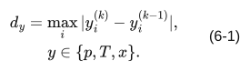
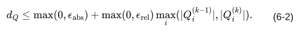

# 第六章 計算手順及び連成方法

対象 commit・版・確認日は[第一章](01_general.md)に同じ。文書版：本文初稿 0.2。\
[全体目次](README.md)

## 1. 適用範囲・記号

p、T、x の相互依存及び空調制御を、同一タイムステップ内の反復により整合させる。n は時間段階、k は連成反復とし、反復回数だけ時間を積算しない。濃度は空調制御が受理された後に更新する。

## 2. 計算順序

1. 当該ステップの時変入力を適用し、ステップ開始状態を保持する。
2. 発熱を scheduled、airconSensible、humidityLatent に分ける。
3. 外側反復を開始する。空調顕熱の成分をクリアして熱源を再構成する。
4. 内側で圧力、熱、条件付きで湿気・潜熱を計算する。
5. 湿気の内側連成が無効なら、湿気を別に一回更新する。
6. 空調機の ON/OFF、能力、風量、吹出湿度を評価する。
7. 再計算が必要なら第3項へ戻る。受理されたら熱収束を確認する。
8. 濃度を一回更新し、結果系列を構築する。

内側の熱計算で使う湿度と、同じ反復で後から求める湿度は同じ評価時点ではない。反復で整合させる。熱交換換気の給気境界も連成計算中に更新する。

## 3. 湿気・潜熱の有効条件

| 条件 | 湿気更新 | 潜熱フィードバック |
|---|---|---|
| x 無効 | なし | なし |
| x 有効、moisture_enabled=False | 外側反復の各周で1回 | 無効 |
| x 有効、moisture_enabled=True | 内側 | t も有効で対応モードの場合 |
| moist_enthalpy_enabled=True | x、t、湿気内側連成が必要 | 別の潜熱モードとの併用を拒否 |

非連成湿気も各外側周で開始時の未知湿度へ戻してから解く。固定湿度境界は戻さず、吹出湿度等の更新を保持する。内側でも積分基準 x^n を固定する。材料の w も開始値から評価する。

## 4. 収束判定

各有効量の変化は最大絶対差とする。

[数式ソース](equations/eq-6-1.tex)

対応する許容値が正なら個別値、そうでなければ convergenceTolerance を用いる。p、T、x は d_y<ε_y の厳密不等号とする。潜熱有効時はさらに式 (6-2) を満たすこととする。

[数式ソース](equations/eq-6-2.tex)

初回の圧力求解が未収束なら、連成不要判定より前に停止する。有効状態量が一つ以下の場合は一回で内側を終える。通常の最小反復は1、空調状態・モードの変化直後は最低2回とする経路がある。上限回でも先に収束を判定し、未収束時だけ上限超過として停止する。

## 5. 外側の再計算

再計算理由は ON/OFF、能力による実効設定温度、風量、吹出湿度の順に扱う。ON/OFF が変わった評価では後段を進めず再計算する。能力調整の後に DUCT_CENTRAL の風量を調整する。

内側上限は maxCouplingIterations、外側上限は maxAirconControlIterations を用い、非正の場合はそれぞれ maxInnerIterations に戻す。外側の既定代替は maxCouplingIterations ではない。

## 6. 出力及び失敗

圧力・湿気・熱の未収束、CouplingMaxIterations、AirconMaxIterations は成功と区別する。反復差が小さいことだけでは、流量収支又は熱収支の合格を意味しない。電力評価の個別例外は第十二章のとおり数値系列が0のまま残る場合がある。

## 7. 根拠・検証

[simulation_runner.cpp](../../engine/solver/simulation_runner.cpp)、[内側連成](../../engine/solver/simulation_inner_coupling.cpp)、[収束判定](../../engine/solver/simulation_coupling_control.cpp)、[空調反復](../../engine/solver/simulation_aircon_iteration.cpp)。
SPEC-06-001：初回圧力失敗を先に判定。SPEC-06-002：上限回で収束すれば受理。SPEC-06-003：開始湿度を固定。
既存 [test_simulation_control_flow.cpp](../../engine/solver/tests_cpp/test_simulation_control_flow.cpp) が判定分岐を扱う。今回 C++ 実行は未実施。
2026-09-17：状態更新、収束及び異常時処理を初稿化。
