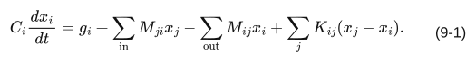
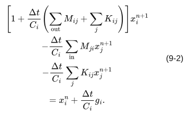
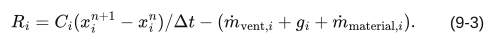

# 第九章 湿気計算

対象 commit・版・確認日は[第一章](01_general.md)に同じ。文書版：本文初稿 0.2。\
[全体目次](README.md)

## 1. 適用範囲

換気移流、発湿、線形湿気伝達及び容量を連立して絶対湿度 x を求める。材料ノードも x を主状態とし、求解後の current_w は current_x と同値にする。非線形吸着等温線、液水移動、結露水貯留の一般モデルではない。

## 2. 入力・記号

| 記号・項目 | 意味・単位 |
|---|---|
| x | 乾き空気基準の湿度比 kg/kg(DA) |
| V | 空気体積 m³ |
| ρ₀ | 固定の乾き空気密度 kg/m³ |
| Mⱼᵢ = ρ₀ abs(qⱼᵢ) | 実流向 j→i の空気質量流量 kg/s |
| g_i | humidity_generation の集計 kg/s |
| K_ij | moisture_conductance、kg/s |
| C_i | 正の moisture_capacity、なければρ₀V |
| Δt | 時間刻み s |

moisture_conductance は表記方向によらず双方向結合である。発湿源は指定された枝の target に加える。湿気移流の密度は固定定数で、温湿度依存密度へ自動置換しない。

## 3. 支配式と離散式

一般式は式 (9-1) とする。

[数式ソース](equations/eq-9-1.tex)

C_i>0 のとき、ソルバが組み立てる行は式 (9-2) である。

[数式ソース](equations/eq-9-2.tex)

固定湿度の項は現在の反復境界値で右辺へ移す。未知湿度は同時に解く。同一上流からの並列枝は合算する。x_i^n は時間段階の開始値であり、直前反復値ではない。

## 4. 容量が正でない場合

流れ・湿気リンク・発生が全てない場合は単位行 x_i=current_x_i を使う。それ以外は式 (9-1) の時間蓄積を除いた代数収支を解く。発生だけがある無容量孤立点は適切な解を持たず、求解失敗になり得る。濃度の V≤0 時の混合処理とは異なる。

## 5. 数値解法及び合格条件

現行実装は Eigen::SparseLU による疎行列直接法である。既存資料の Gauss–Seidel という記載は本対象 commit の求解方法に適用しない。構造が同じなら解析結果を、係数も同じなら分解を、右辺も同じなら解を再利用する。

r=A_x x−b とし、b のユークリッドノルムが正なら ||r||₂/||b||₂、ゼロなら ||r||₂ を許容値と比較する。tolerance が正でない場合、この関数の代替値は1e-9。非有限の解又は x<−1e-12 は不合格、−1e-12≤x<0 は0へ丸める。未収束の解はグラフへ反映しない。

## 6. 設備境界・潜熱・制約

空調ノードは湿気の固定境界とする。停止中又は current_mode が COOLING 以外の空調に直接接続する吸込・吹出枝は湿気移流から除外する。熱・換気の流量は保持されるので、異室間の湿気混合を省く近似がある。AUTO という文字列もこの判定では除外対象となる。

湿気伝達の phase_change、vapor_diffusion、liquid_transport、sorption は現時点で同じ KΔx の式を使う。phase_change のみ材料相変化の潜熱診断に用いる。sorption という分類値があることは非線形吸着式の実装を意味しない。

from_phase_change は材料側の相変化量から潜熱を計算する。from_humidity_change は湿度変化全体を熱源化する非推奨の経路。moist_enthalpy_enabled との併用禁止等は C++ パーサに従う。raw からこれらの設定を渡せない現状は第五章のとおり。

線形湿気ソルバには、全ノードの x を飽和湿度へ一律にクリップする処理はない。空調潜熱処理の飽和判定と、一般の結露水モデルを区別する。

## 7. 出力・収支

humidity_x は kg/kg(DA)、humidity_flux は kg/s。収支残差は式 (9-3) とする。

[数式ソース](equations/eq-9-3.tex)

空調除湿診断は吹出境界に織込み済みであり、残差へ再加算しない。

## 8. 検証・根拠

体積100 m³、ρ₀=1.2、流入・流出0.1 m³/s、外気x=0.005、初期x=0.01、Δt=60、発湿なしの場合、後退差分解は (0.01+0.06×0.005)/1.06=0.00971698113207547。

根拠：[humidity_coupling.cpp](../../engine/solver/core/humidity/humidity_coupling.cpp)、[humidity_solver.cpp](../../engine/solver/core/humidity/humidity_solver.cpp)、[humidity_network.cpp](../../engine/solver/network/humidity_network.cpp)。
SPEC-09-001：SparseLU。SPEC-09-002：負値・非有限判定。SPEC-09-003：無容量分岐。
2026-09-17：現行の行列・解法・制約を初稿化。検証実行の範囲は第十四章。
