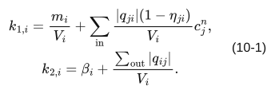
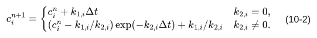
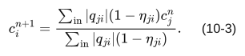

# 第十章 濃度計算

対象 commit・版・確認日は[第一章](01_general.md)に同じ。文書版：本文初稿 0.2。\
[全体目次](README.md)

## 1. 適用範囲及び単位

calc_c=True のノードで、移流、発生、沈着、流路除去を計算する。c を個/m³とする場合、dust_generation は個/s、beta は1/s、流量はm³/s、体積はm³とする。別の物質量を使用する場合も、発生量と濃度に一貫した次元を与える。

units.py の concentration_c「-」及び concentration_flux「kg/s」はこの自由度を完全には表していない。個数基準の計算を質量へ自動換算する処理はない。

## 2. 流入・流出・発生

有効な換気枝だけを集計する。q<0なら上流と下流を反転する。実上流の流出量には |q|、実下流の流入には |q|(1−eta) を用いる。除去効率は流入側にのみ掛け、流出量は減らさない。同じ上流からの並列流入は合算する。

dust_generation は枝の target に加える。発生先は q の反転に追従しない。更新対象のノードは key 順に並べるが、全て旧濃度を参照するため逐次の上書き値を利用しない。

## 3. 正の体積に対する更新式

V_i>0 の場合、係数は式 (10-1) による。

[数式ソース](equations/eq-10-1.tex)

m_i は発生量、k₁ は濃度/s、k₂ は1/s。各ステップ内で係数と流入元の濃度を固定し、dc_i/dt=k₁−k₂c_i を式 (10-2) で更新する。

[数式ソース](equations/eq-10-2.tex)

これは各室の係数固定時の解析更新であり、多室濃度連立系全体の厳密解ではない。流入元が計算対象でも c_j^n を使う。時間刻み依存をなくす保証はない。

## 4. 非正の体積

V_i≤0 の場合、発生と沈着を無視し、式 (10-3) の流入混合だけを行う。

[数式ソース](equations/eq-10-3.tex)

分母が正でなければ旧値を保持する。完全除去 eta=1 の枝のみの場合も分母0となり、旧値を保持する。これは有限体積の物質収支と同一ではない。

## 5. 非物理解・計算無効

濃度計算が無効又は Δt が正でなければ更新しない。更新対象が空なら収束扱いで戻る。

全更新対象の候補値を検査してから一括反映する。非有限又は c<−1e-12 の値が一つでもあれば updated=False、converged=False とし旧状態を保つ。−1e-12≤c<0 は0とする。上流に同一ステップの新値を混在させない。

## 6. 出力・照合例

concentration_c は calc_c=True のノードを key 順に出力する。固定濃度境界はこの未知濃度系列には含めない。

体積100 m³、換気流入・流出0.1 m³/s、外気濃度0、発生・沈着なし、初期濃度100、Δt=60 s の場合、k₂=0.001、次の濃度は100 exp(−0.06)=94.1764533584。湿気の後退差分更新と同じ式に置き換えない。

## 7. 根拠・検証・履歴

[concentration_solver.cpp](../../engine/solver/transport/concentration_solver.cpp)、[contaminant_network.cpp](../../engine/solver/network/contaminant_network.cpp)、[濃度出力](../../engine/solver/network/contaminant_network_outputs.cpp)。
SPEC-10-001：旧値固定の指数更新。SPEC-10-002：V≤0 分岐。SPEC-10-003：一括検査・反映。
[既存輸送テスト](../../engine/solver/tests_cpp/test_transport_humidity_concentration.cpp)。今回 C++ 実行は未実施。
2026-09-17：濃度独立章を新規作成。
