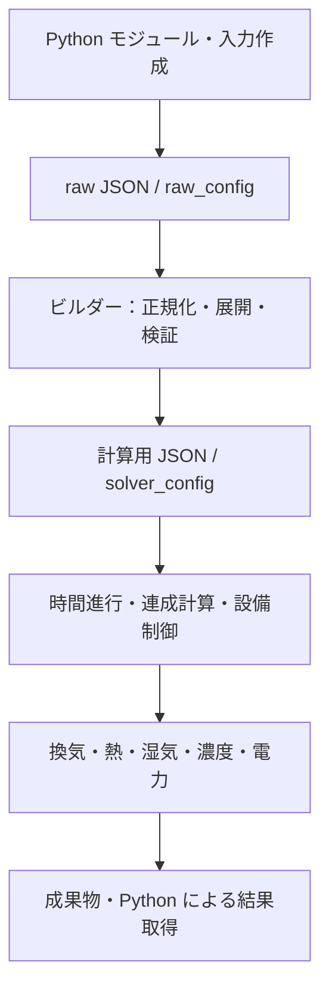

# VTSimNX 仕様書 — 全体目次

文書版：本文初稿 0.2／作成日：2026-09-17
構成調査の対象：パッケージ 1.8.0、commit `07a2181cec92029f841c4be63fe5c0932ba95ece`

## 1. 目的と位置づけ

Python モジュールによる入力作成から、raw JSON、ビルダーによる計算用 JSON への変換、換気・熱・湿気・濃度・電力の計算、結果取得までを体系的に規定する。

本仕様書は、別途作成中の技術情報・技術解説書とは独立した文書群である。独自の章番号、改訂履歴、確認状況を持つ。既存 Word／PDF の改訂や同期は今回の整備対象に含めない。

全14章と付録の本文初稿を整備した。本仕様書は対象 commit の実装を基準とし、既存文書との不一致は実装に合わせて記述する。各章の確認範囲と追加詳細化項目は第十四章に示す。別途作成中の技術情報とは独立して管理する。

## 2. 記述方法の参考

建築研究所の[住宅のエネルギー消費性能に関する技術情報・現行版](https://www.kenken.go.jp/becc/house.html)（2026-09-17 確認）を構成と記述方法の参考とする。特に[第五章 換気設備](https://www.kenken.go.jp/becc/documents/house/5_210401_v07.pdf)の、適用範囲、引用規格、用語、記号・単位、計算方法の順に示す構成を参考とする。

本仕様書では、その構成に入出力契約、離散化、数値解法、異常時の処理及び検証条件を加える。参考資料と同じ計算方法を採用することや、省エネルギー基準への準拠を意味しない。

[執筆要領・節テンプレート](writing_rules.md)／[整備計画・既存資料との対応](development_plan.md)

## 3. 対象範囲

図は情報の受渡し範囲を示す。物理計算と設備制御の実際の順序、反復位置、確定条件は第六章で規定する。

## 本文への入口

- [第一章 総則](01_general.md)
- [第二章 Python モジュール](02_python.md)
- [第三章 raw JSON の入力仕様](03_raw_json.md)
- [第四章 ビルダーによる計算用 JSON の生成](04_builder.md)
- [第五章 計算用 JSON 及び計算初期化](05_solver_json.md)
- [第六章 計算手順及び連成方法](06_coupling.md)
- [第七章 換気計算](07_ventilation.md)
- [第八章 熱計算](08_thermal.md)
- [第九章 湿気計算](09_moisture.md)
- [第十章 濃度計算](10_concentration.md)
- [第十一章 設備モデル及び制御](11_equipment.md)
- [第十二章 電力及び消費電力量の算定](12_power.md)
- [第十三章 計算実行及び出力仕様](13_output.md)
- [第十四章 検証方法及び適用限界](14_validation.md)
- [付録](appendices.md)

## 4. 全体目次

以下は詳細化後の構成案である。現時点の本文初稿は各章リンクを正とし、以下の節すべての記載完了を意味しない。章番号は本仕様書内の番号である。本文は必要に応じて節単位のファイルに分割する。

### 第一章 総則

1. 目的及び適用範囲
2. 対象プログラム、対象版及び文書体系
3. 用語の定義（ノード、ブランチ、境界、状態量、連成等）
4. 共通記号、添え字、単位及び符号規約
5. 時刻、時間刻み及び時系列の定義
6. 対応機能、近似及び適用外の条件

### 第二章 Python モジュール

1. モジュール構成及び公開 API の区分
2. 入力・戻り値の型、配列及び DataFrame
3. 気象・湿り空気に関する補助計算
4. 日射・日影・夜間放射・風圧・地盤温度及び快適性指標
5. 材料・部材データ及び物性値の取得
6. 生活・空調・換気・発熱・発湿スケジュール
7. Python オブジェクトの JSON 化及び時刻情報の正規化
8. `run_calc`、計算要求、待機、タイムアウト及び例外
9. 結果オブジェクト、成果物取得及び遅延読込み
10. 互換性、非推奨 API 及び移行

### 第三章 raw JSON の入力仕様

1. トップレベル構造及びビルダーオプション
2. 計算条件 `simulation`
3. ノード `nodes`
4. 換気ブランチ `ventilation_branches`
5. 熱ブランチ `thermal_branches`
6. 面・壁体・開口部 `surfaces`
7. 空調機 `aircon` 及び機器仕様
8. 熱交換換気 `heat_recovery_vent`
9. 発熱源 `heat_source`、発湿源 `humidity_source` 及び濃度発生条件
10. 材料の湿気特性及び湿気容量
11. 必須・任意、既定値、欠損、スカラー・時系列及び排他条件
12. キー、接続表記、コメント表記及び不正入力

### 第四章 ビルダーによる計算用 JSON の生成

1. 入力・出力、変換工程及び工程間の依存関係
2. 入力読込み、キー正規化及び接続の展開
3. ノード・ブランチの生成、識別子及び重複処理
4. 面からの熱回路網生成（RC・応答係数・日射・放射）
5. 熱容量、発熱源及び発湿源の展開
6. 湿気回路網及び湿気容量の生成
7. 空調機及び熱交換換気の接続・制御情報の生成
8. 計算フラグ、型、単位及び時系列の正規化
9. 検証、未知フィールド、警告及びエラー
10. raw JSON と計算用 JSON の変換前後の対応例

### 第五章 計算用 JSON 及び計算初期化

1. 計算用 JSON の構造及び入力責任の境界
2. `simulation`、ノード及びブランチの正規化後の項目
3. 設備情報、生成項目及び参照関係
4. C++ パーサの受入条件、既定値及び拒否条件
5. 固定境界、未知量及び初期値
6. 計算ネットワークの構築及び計算対象の選択
7. ビルダー出力とパーサ入力の整合条件

### 第六章 計算手順及び連成方法

1. 計算全体の手順及び時間進行
2. 時変条件の更新及びステップ開始状態の保存
3. 換気・熱・湿気の内側連成
4. 湿気の非連成計算
5. 空調制御を含む外側反復
6. 濃度計算及び電力評価の実施位置
7. 収束指標、許容誤差及び反復上限
8. 未収束、フォールバック及び計算中止
9. ステップ受理、履歴更新及び結果確定

### 第七章 換気計算

1. 適用範囲、記号及び単位
2. ノードの圧力及び流量収支
3. 隙間・開口・流路の圧力差と流量の関係
4. 固定流量及びファンの圧力・流量特性
5. 風圧、浮力及び高さ
6. 圧力基準、固定境界及び接続条件
7. 非線形方程式、ヤコビアン及び解法
8. 逆流、ゼロ流量、並列流路及び不成立条件
9. 圧力・流量の出力及び収支検証

### 第八章 熱計算

1. 適用範囲、記号及び単位
2. ノードの熱収支及び時間離散化
3. 熱伝導及び熱容量（RC 法）
4. 応答係数法・CTF、係数生成及び履歴
5. 対流及び放射熱交換
6. 日射取得、吸収及び室内配分
7. 換気による熱輸送及び湿り空気
8. 内部発熱、境界温度及び地盤・外界条件
9. 行列の構築、境界条件及び数値解法
10. 近似、安定化及び適用限界
11. 温度・熱流の出力及び収支検証

### 第九章 湿気計算

1. 適用範囲、記号及び単位
2. 絶対湿度・相対湿度・水蒸気圧の関係
3. 換気による水分輸送及び発湿
4. 湿気容量、材料内輸送及び吸放湿
5. 飽和、結露及び蒸発の取扱いと対応範囲
6. 空調除湿及び熱交換換気との水分の受渡し
7. 潜熱と熱計算の連成
8. 時間離散化、境界条件及び数値解法
9. 湿度・水分流量の出力及び収支検証

### 第十章 濃度計算

1. 対象とする濃度、適用範囲及び単位
2. ノードの物質収支及び換気による移流
3. 発生、沈着及び流路の除去効率
4. 固定濃度境界、初期濃度及び時間変動
5. 時間離散化及び数値解法
6. 逆流、ゼロ流量及び値の制限
7. 濃度・物質流量の出力及び収支検証

### 第十一章 設備モデル及び制御

1. 設備の計算範囲及び回路網との接続
2. 空調機の吸込・吹出・外気及び温度制御対象
3. 運転モード、ON/OFF、設定値及び待ち時間
4. 顕熱・潜熱処理及び能力上限
5. 吹出状態、風量制御及び全館空調
6. 熱交換換気の四ポート接続、顕熱・全熱交換
7. 設備状態の更新及び再計算条件
8. 設備出力、異常時の取扱い及び適用限界

### 第十二章 電力及び消費電力量の算定

1. 算定対象、対象外、記号及び単位
2. 処理熱量、COP 及び消費電力の関係
3. 機種別モデルの入力、補正及び計算方法
4. 部分負荷、ゼロ負荷、停止時及びモデルの限界
5. ファン・補機電力の算入範囲及び二重計上の防止
6. 電力から消費電力量への時間積算
7. 機器別・期間別集計及び欠測・未算定の取扱い
8. 出力系列、単位換算及び検証

ファンの流量計算とファン電力の算定は区別する。電力量集計を含め、実装済み・利用者側で算定・未対応の範囲を本文調査時に確定する。

### 第十三章 計算実行及び出力仕様

1. HTTP API、要求・応答及び実行状態
2. 計算用ファイル、成果物及び manifest
3. `schema.json`、系列名、キー及び並び順
4. バイナリ形式、時刻、精度及び空系列
5. Python での復元、DataFrame 及び単位情報
6. ログ、警告、失敗及び取得エラー
7. 結果再現に必要な入力・版・設定の記録

### 第十四章 検証方法及び適用限界

1. 仕様項目・実装・テストの対応
2. 入力契約及び JSON 変換の検証
3. 既知解・保存則・単位・符号の検証
4. 時間刻み、収束条件及び数値安定性
5. 設備単体・連成・計算全体の検証
6. 比較計算、回帰及び許容差
7. 未検証条件、既知の制約及び仕様差異

### 付録

A. 共通記号・添え字・単位一覧\
B. 定数・材料・設備パラメータ及び出典\
C. raw JSON／計算用 JSON／出力の項目対応表\
D. 最小計算例及び変換・計算過程の照合例\
E. 警告・エラー一覧\
F. 改訂履歴及び対象プログラムとの対応
