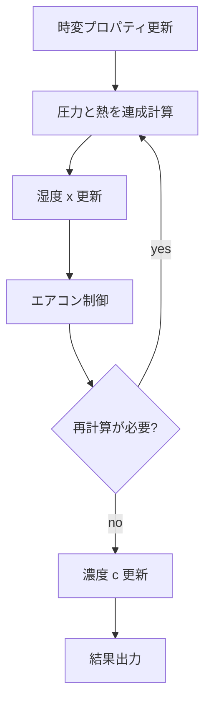

### エアコン制御の概要

このドキュメントは、solver 側のエアコン制御が

- どのノード/ブランチを使うか
- 1 タイムステップの中でいつ動くか
- ON/OFF 判定をどうしているか
- 処理熱量・能力上限をどう扱うか

をまとめたものです。

主な実装箇所:

- `solver/aircon/aircon_controller.cpp`
- `solver/simulation_runner.cpp`
- `solver/core/thermal/thermal_direct_build.cpp`
- `solver/core/thermal/thermal_direct_rhs.cpp`

---

### 1. エアコンノードの役割

builder で `aircon` を与えると、solver 形式では `type="aircon"` のノードと、送風を表す換気ブランチが追加されます。

主な項目:

- `key`: エアコンノード名
- `in_node`: 還気側（室内側）
- `set_node`: 設定温度をかける対象室
- `outside_node`: 外気条件参照先
- `mode`: `OFF` / `HEATING` / `COOLING` / `AUTO` の時系列
- `pre_temp`: 設定温度の時系列
- `ac_spec`: 能力・消費電力・風量などの仕様

`pre_temp` は solver 側では `vector<double>` として保持し、各 timestep で `current_pre_temp` に展開されます。

---

### 2. タイムステップ内での位置づけ

エアコン制御は、圧力-熱の連成計算が一度落ち着いた後に実行されます。



入口は `solver/simulation_runner.cpp` の `runAirconControlAndAdjust()` です。

1. `checkAndAdjustDuctCentralAirflow()` で DUCT_CENTRAL の風量補正を先に確認する
2. `controlAllAircons()` で ON/OFF を決める
3. 全台の ON/OFF が安定していれば `checkAndAdjustCapacity()` で能力超過を確認する
4. いずれかで修正が入れば `shouldRecompute=true` を返し、同じ timestep の outer loop をやり直す

---

### 3. ON/OFF 判定

`controlAllAircons()` は、`set_node` の現在温度と `current_pre_temp` を比べて ON/OFF を決めます。

- 暖房:
  - 室温が設定温度より低ければ ON
  - 高ければ OFF
- 冷房:
  - 室温が設定温度より高ければ ON
  - 低ければ OFF
- `AUTO`:
  - 許容帯の外なら ON、許容帯内では現状態を維持

収束性を落とさないため、許容誤差帯の中では即座に反転せず deadband を持たせています。

注意:

- `set_node.calc_t` は ON/OFF に応じて切り替えていません
- 実際の固定温度化は熱ソルバ側の fixed-row ロジックで行います

---

### 4. 熱ソルバとの接続

エアコンが ON のとき、`set_node` は熱ソルバ内で固定温度行として扱われます。

固定温度に使う値:

- `graph[v_ac].current_pre_temp`

主な参照箇所:

- `solver/core/thermal/thermal_direct_build.cpp`
- `solver/core/thermal/thermal_direct_rhs.cpp`

このため、エアコン制御が `current_pre_temp` を更新すると、次の再計算ではその値が新しい境界条件として使われます。

---

### 5. 処理熱量の定義（顕熱・潜熱）

処理熱量は、内部的に次の 2 つを区別して扱います。

- 顕熱 `sensibleHeatCapacity` [W]
- 潜熱 `latentHeatCapacity` [W]

`AirconController::calculateHeatCapacity()` は顕熱の基礎量を計算します。

概念的には次です。

- `sensible = rho_air * cp_air * |flowRate| * deltaT`（有効な向きのみ）

ここで:

- `flowRate`: `in_node -> airconNode` の流量
- **暖房時**: `deltaT = outletTemp - inletTemp`。**出口温度 ≤ 入口温度のときは 0**（加熱していない）
- **冷房時**: `deltaT = inletTemp - outletTemp`。**入口温度 ≤ 出口温度のときは 0**（除熱していない）

顕熱・潜熱ともに「処理熱量の大きさ [W]」として正値で扱います。  
acmodel 入力では `Q_S=顕熱`, `Q_L=潜熱`, `Q=Q_S+Q_L` を渡します。

---

### 6. 潜熱計算（latent_method）

冷房時の吹出絶対湿度 `supplyX` と潜熱は、`ac_spec.latent_method` で方式を切り替えます。

**方式一覧（冷房時のみ有効）**

- `rh95`（**デフォルト**）  
  吹出温度 `Tout` が決まったら、吹出空気を **RH=95%** とみなして `supplyX` を決定します。
- `bf`  
  バイパスファクタ法で `supplyX` を計算します（`bf`/`BF`/`bypass_factor`、既定 `0.2`）。  
  BF 法で求めた吹出 RH が 100% を超えた場合は、警告を出して **RH95 法へフォールバック** します。
- `coil_aoaf`（別名: `"aoaf"`, `"literature"`）  
  既往文献に基づく **コイル前面風速・有効表面積を用いた方式**です。
  - 入力: 顕熱処理量 `Hs`、吸込温度/絶対湿度、吹出温度、風量 `V` など
  - パラメータ:
    - `Af` または `coil_face_area` : 実質コイル前面面積 [m²]（既定 `0.133`）
    - `Ao` または `coil_surface_area` : コイル有効表面積 [m²]（既定 `4.84`）
  - 手順（概略）:
    - 吸込条件と顕熱負荷から吹出条件（仮の `Te, Xe`）を決める
    - 中間状態 `T*, X*` を取り、前面風速 `Vx = V / Af` から潜熱伝達率 `Kx` と対流熱伝達率 `αc` を求める
    - コイル表面温度 `Td` を算出し、その飽和絶対湿度 `Xd` との差から除湿量 `Hr` [W] を評価
    - `Hr` から水蒸気質量流量を逆算し、出口絶対湿度 `supplyX` を決める
- `none`  
  潜熱処理なし（`Q_L=0`、`supplyX = X_in`）。

いずれの方式でも、計算された `supplyX` は aircon ノードの `current_x` に反映され、  
次ステップおよび `humidity_x` 出力の初期値として利用されます。

---

### 7. 能力上限の扱い

能力上限チェックは `checkAndAdjustCapacity()` で行います。

参照する上限:

- **`ac_spec.Q.<mode>.max`** を優先
- **`max` が無い場合は `ac_spec.Q.<mode>.mid`** を使用（DUCT_CENTRAL / LATENT_EVALUATE など `mid` のみの仕様に対応）
- 両方無い機種は能力制限を掛けません（上限なしとして扱う）

`Q.rtd` や `max_heat_capacity` は、この制御では参照しません。

---

### 8. DUCT_CENTRAL の処理熱量連動風量（外側ループ連成）

`model="DUCT_CENTRAL"` かつ運転中の機器については、能力補正の前段で風量を見直します。

目的:

- 処理熱量と送風量の自己整合を取る
- 風量が変わることで換気/熱回路網の解が変わるため、outer loop 再計算につなぐ

仕様:

- 処理熱量が `0` のとき、目標風量は `0`
- 処理熱量が `Q.<mode>.rtd` のとき、目標風量は `V_inner.<mode>.dsgn`
- その間は線形補間（上限は `dsgn`）

式（mode は `heating` / `cooling`）:

- `ratio = clamp(Q_processed / (Q.<mode>.rtd * 1000), 0, 1)`
- `V_target = V_inner.<mode>.dsgn * ratio`

ここで:

- `Q_processed` は controller 内部の全熱（`Q_S + Q_L`, [W]）
- `Q.<mode>.rtd` は `ac_spec` 上の [kW]
- `V_inner.<mode>.dsgn` は [m3/s]

実装上は `in_node <-> aircon_node` の `fixed_flow` 換気枝を更新し、変更が入った場合は `shouldRecompute=true` を返します。

注意:

- この補正は DUCT_CENTRAL 専用です（他モデルには適用しません）。
- 現時点では `fixed_flow` 枝を対象とした運用を前提にしています。

---

### 9. 能力超過時の設定温度補正

エアコンが ON で、かつ

- `current totalCapacity > 最大能力（上記 max または mid）`

になった場合、`checkAndAdjustCapacity()` は**処理熱量が最大能力と等しくなる**設定温度を求め、`current_pre_temp` を補正します。

ここでの `totalCapacity` は **全熱（顕熱+潜熱）** [W] です。

方針:

- 暖房時: 設定温度を下げる
- 冷房時: 設定温度を上げる
- 運転モードは固定する
- ON/OFF は次の outer loop で再判定してよい

補正方法（2段階）:

1. **公式による補正**  
   `findCapacityLimitedSetpoint(...)` で、入口温度・風量・運転モードを固定した近似のもと、`heatCapacity <= maxHeatCapacity` となる setpoint を算出。有効な setpoint が得られればそれを適用。
2. **二分探索（フォールバック）**  
   公式で有効解が得られない場合、熱ソルバの解（処理熱量）を利用した bracket 二分探索で、処理熱量 ≒ 最大能力 となる setpoint を求める。収束判定は「処理熱量が最大能力に十分近い」（相対 0.1% + 絶対 1W）で行い、bracket のみ狭まった場合はあと 1 回再計算してから完了。

補正後は `adjustmentMade=true` を返し、`simulation_runner.cpp` が同じ timestep を再計算します。  
処理熱量が最大能力を**下回る**状態で既に bracket が存在する場合（例: 設定を下げすぎて処理熱量が 0 に近い）は、設定温度を上げる方向に bracket を更新して探索を継続します。

---

### 10. 現在の近似と制約

初期実装では、二分探索の**各試行ごとに full thermal solve はしていません**。

つまり、探索中は

- 入口温度
- 流量
- 運転モード

を固定した近似で setpoint を求め、最終的な整合は outer loop の再計算で取ります。

利点:

- 実装が小さい
- 既存の `shouldRecompute` 導線をそのまま使える
- 熱ソルバの係数行列再利用とも相性がよい

制約:

- 実際の連成系では setpoint と処理熱量の関係が完全単調とは限らない
- `AUTO` は `prepareRuntimeContext()` 内で暖房/冷房に解決された後のモードを固定して探索する
- より厳密な制御が必要なら、将来は「各試行ごとに熱計算も回す高精度版」へ拡張余地がある

---

### 11. ログ

能力チェック時は `solver.log` に次のような情報を出します。

- aircon key
- 最大処理熱量
- 現在処理熱量（全熱、顕熱/潜熱内訳付き）
- 超過/OK
- 補正前後の設定温度
- 再計算要求の有無

例（能力チェック）:

```text
ac1 最大処理熱量=500.00W (Q.heating.max 基準), 現在処理熱量(全熱)=820.00W (顕熱=700.00W, 潜熱=120.00W) → 超過, 設定温度補正=26.00→23.41°C, 再計算要求
ac1 最大処理熱量=500.00W (Q.heating.max 基準), 現在処理熱量(全熱)=499.20W (顕熱=430.00W, 潜熱=69.20W) → 二分探索収束 設定温度=23.10°C（処理熱量≒最大能力）
```

---

`bf` 選択時に RH>100% となった場合のログ例:

```text
[WARN] bf法の吹出点相対湿度が100%を超えたためRH95法へフォールバック: ac1 RH(bf)=102.31% -> RH(out)=95.00%
```

---

DUCT_CENTRAL 風量補正のログ例:

```text
ac1 DUCT_CENTRAL風量補正: 処理熱量=3624.00W, Q.rtd=7200.00W, 比率=0.5033, 風量 0.3000→0.1007 m3/s, 再計算要求
```

---

### 12. 関連ドキュメント

- `docs/simulation_overview.md`
- `docs/acmodel_overview.md`
- `docs/aircon_spec_reference.md`（モデル別 ac_spec の形と能力上限キー）
- `docs/builder_json.md`
