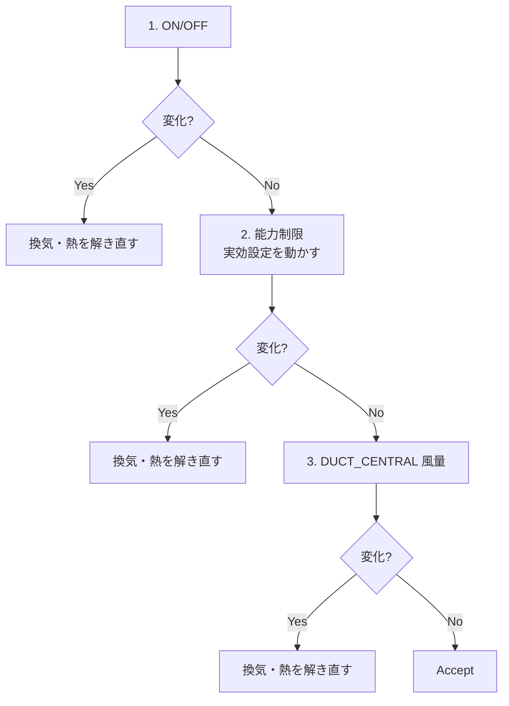

# 空調制御の考え方

この文書は、solver のエアコン制御が **何を同時に揃えたいか** と、そのために **どの量を外生として固定し、どの量を解き直すか** を残すためのものです。手順の正本は [`aircon_control_overview.md`](aircon_control_overview.md)、ループの位置は [`simulation_loops.md`](simulation_loops.md) です。

対象は主に `model="DUCT_CENTRAL"` です。ON/OFF と能力制限の骨格は他モデルと共通です。送風量を処理熱へ追従させるのは DUCT_CENTRAL だけです。

---

## 1. 揃えたいもの

1 タイムステップの採用状態では、次が矛盾しないことを目指します。

| 量 | 揃え方 |
|---|---|
| ON/OFF | 要求設定と負荷で決める。能力不足で勝手に OFF しない |
| 温度 | 能力が足りれば要求設定。足りなければ実効設定（能力制限） |
| 処理熱 | 設定維持に必要な室負荷、または能力上限 |
| 風量 | 負荷 0 なら 0、負荷が定格以上なら設計風量。間は線形 |

「ぴったり」は、同じ呼び出しの中で 4 つを同時に書き換えることではありません。外側ループで **決める → 換気と熱を解き直す → もう一度見る** を、固定点が安定するまで繰り返すことです。採用される処理熱は、更新後の風量で解いた結果です。

---

## 2. なぜ同時に動かさないか

風量を変えると、移流とコイルの温度差が変わり、処理熱が変わります。処理熱が変わると、次の風量も変わります。ON/OFF や設定温度も同じタイムステップで動かすと、原因が混ざって振動します。

そのため空調評価は常にこの順です。後段は、前段が変わったら走りません。

風量は最後です。能力探索の途中では風量を固定します。

風量が変わったあとは、同じ関数の中で処理熱を再計算しません。`fixed_flow` を書き換えて外側ループへ戻り、新しい風量で圧力・温度・湿度を解いてから、もう一度 ON/OFF・能力・風量を見ます。目標風量が今の枝と許容内なら、それ以上は変えません。

---

## 3. 温度は二系統

| 量 | 役割 |
|---|---|
| 要求設定 `current_requested_pre_temp` | スケジュールの目標。ON/OFF はこれを見る |
| 実効設定 `current_pre_temp` | 熱ソルバの固定温度。能力が足りないときだけ動く |

- 能力が足りる: 実効設定 = 要求設定。室温（`set_node`）はその温度に張る。
- 能力が足りない: 実効設定だけを動かし、処理熱が能力上限になる点を探す。運転モードは固定する。ON/OFF は次の周で要求設定から再判定してよい。
- タイムステップ先頭で実効設定は要求設定へ戻す。前ステップの能力制限を引きずらない。

能力上限は `Q.<mode>.max` → `rtd` → `mid` です。いずれも無い機種は能力制限を掛けません。

---

## 4. 負荷として何を使うか

ここが制御の芯です。コイルで「今運ばれている熱」と、設定を維持するのに「必要な熱」は別です。

### 4.1 室負荷 `required_heat_w`

`set_node` を実効設定に保つために必要な符号付き熱量です。暖房が正、冷房が負です。

- 還気・吹出が `set` に直結しているとき: `set` の熱収支から空調寄与を除いた残り。外皮・内部発熱・他室とのやり取りで決まり、風量にはほぼ比例しません。
- `set` が吸込・吹出と別室（遠隔 set）のとき: 固定温度行のあと `set` 収支はほぼ 0 になるため、コイル処理熱で代替します。この代替値は風量に比例し得ます。

ON/OFF が室負荷を使うのは、`set_node` が実効設定の近傍にあり、能力制限中でなく、処理風量がほぼ 0 でないときだけです。大きく外れている室温や、風量 0 付近の見かけ負荷では、温度バンドへ戻して ON/OFF の振動を防ぎます。

### 4.2 計測コイル熱

吸込と吹出の状態と風量から求まる、今コイルが運んでいる全熱 \(Q_S + Q_L\) です。

設定温度と吹出温度が固定されていると、顕熱はだいたい \(Q \propto V\) です。この熱を風量の基準にすると \(V \propto Q \propto V\) になり、唯一の安定点が 0 になります。固定温度の通常運転では、風量比に使いません。

`set_node` がなく室温が自由なときだけ、計測全熱を負荷とみなします。室温が動くので、処理熱は風量に比例して潰れません。

### 4.3 能力上限 `Q_max`

機械が出せる熱の上限です。室が要求に届いていないとき、および能力制限中は、負荷の代理としてこれを使います。追いつくまで、または上限運転のあいだは、設計風量側へ寄せるためです。

---

## 5. 風量の決め方（DUCT_CENTRAL）

運転中だけ、次で 1 つの目標風量を決めます。単位は風量が `m³/s`、仕様の能力が `kW` です。

\[
V = V_\mathrm{inner}.\mathrm{dsgn} \times \mathrm{clamp}\left(\frac{Q_\mathrm{basis}}{Q.\mathrm{rtd}\times 1000},\, 0,\, 1\right)
\]

端点は次だけを保証します。

| 負荷 \(Q_\mathrm{basis}\) | 風量 |
|---|---|
| 0 | 0 |
| \(Q.\mathrm{rtd}\) 以上 | \(V_\mathrm{inner}.\mathrm{dsgn}\) |
| その間 | 線形 |

目標が `1e-4 m³/s` 未満なら 0 に切り捨てます。`Q.rtd` または `V_inner.dsgn` が無い機種は補正しません。

ここでいう最大風量は \(V_\mathrm{dsgn}\) です。\(V_\mathrm{rtd}\) や \(V_\mathrm{mid}\) はモデル内部の定格・中間点用で、制御の上限ではありません。

### 5.1 基準熱量の切り替え

| 状態 | \(Q_\mathrm{basis}\) | 理由 |
|---|---|---|
| 能力制限中 | `Q_max` | 処理熱も上限に揃える。計測熱で追従しない |
| 室温が要求に未達（暖房は 0.5 K 以上低い、冷房は 0.5 K 以上高い） | `Q_max` | 追いつくまで設計風量側 |
| 設定を保持できている | \(\|required\_heat_w\|\)。上限は `Q_max` | 室負荷は風量にほぼ比例しない |
| 上で室負荷が非有限 | `Q_max` | コイル熱へ落とすと 0 へ縮小する |
| `set_node` なし | 計測全熱 | 室温が自由 |

未達の判定は要求設定に対して行います。能力制限で実効設定をずらしているあいだは、未達でも能力制限側（`Q_max`）です。

### 5.2 「最大」が二つある

能力の最大は `Q.max`（無ければ `rtd`）、風量の最大は `V.dsgn` です。比の分母は常に `Q.rtd` です。

したがって `Q.max` が `Q.rtd` より小さい機種では、能力いっぱいでも風量は \(V_\mathrm{dsgn} \times Q_\mathrm{max}/Q_\mathrm{rtd}\) であり、`V.dsgn` には届きません。負荷 0 と定格以上の端点は上表のとおりです。

### 5.3 吸込と吹出は同じ風量

目標 \(V\) は還気と吹出の両方に、同じ大きさ・循環向きで載せます。

| 枝 | 向き | 風量 |
|---|---|---|
| 吸い込み口 → 空調機 | 空調機へ入る | \(+V\) |
| 空調機 → 吹出口 | 空調機から出る | \(+V\) |

`in` と `out` が同じ室でも、吹出を逆符号にしません。吸込だけが目標でも、吹出がずれていれば合わせて外側を解き直します。処理熱・COP・吹出温度に使う処理風量は吸込側です。

初期値は両方とも設定の `vol`（未指定なら `1000/3600` m³/s）です。連成が安定すると上式の値に置き換わります。

停止中は風量補正をしません。負荷 0 で風量 0 になるのは、運転中かつ基準熱量が 0 のときです。OFF のあと直前風量が残る点は、今の仕様の限界です。

### 5.4 仕様風量の役割

| キー | 使い道 |
|---|---|
| `V_inner.<mode>.dsgn` | 制御の上限。送風機電力の設計風量 |
| `V_inner.<mode>.rtd` / `mid` | モデル内部の定格・中間点。運転風量そのものではない |
| `V_vent` | 換気分。`V_outer` とは別。未指定時は 0 |

決まった送風量はモデル内部で `m³/h` に換算し、吹出温度と送風機電力に使います。送風機電力は処理熱があるときだけ計上します。

---

## 6. 状態ごとの固定点

### 6.1 部分負荷（設定を保持できている）

- ON のまま
- 温度 = 要求設定
- 処理熱 ≒ 室負荷
- 風量 = \(V_\mathrm{dsgn} \times |Q_\mathrm{req}| / Q_\mathrm{rtd}\)（定格以上は `V_dsgn`）

室負荷は風量が少し変わっても大きくは動きません。外側を 1 回解き直せば、多くの場合風量はもう一致します。

### 6.2 能力制限

- ON のまま（要求設定には未達でも OFF しない）
- 実効設定だけを動かし、処理熱 = `Q_max`
- 風量 = \(V_\mathrm{dsgn} \times Q_\mathrm{max} / Q_\mathrm{rtd}\)（比は 1 で頭打ち）

### 6.3 未達（まだ設定に届いていない）

- ON
- 風量は `Q_max` 基準（追いつくまで設計風量側）
- 室温が要求の 0.5 K 以内に入ったら、部分負荷の室負荷へ切り替える

### 6.4 室温が自由（`set_node` なし）

- 風量は計測全熱に比例
- 風量変更後に計測熱も変わるので、比が安定するまで外側を繰り返す

---

## 7. やってはいけないこと

- 固定温度のあいだ、計測コイル熱で風量を更新する。\(V\) が 0 へ縮む。
- 還気だけ風量を変え、吹出を初期 `vol` のままにする。室の出入りが一致しない。
- `in == out` の吹出枝を、還気ペアの逆向きとして負号にする。循環が逆になる。
- ON/OFF・能力・風量を同じ周で一度に更新する。
- 風量を変えた直後の、古い風量で計算した処理熱を採用する。必ず解き直したあとの熱を使う。

---

## 8. 残している近似

- 遠隔 set の `required_heat_w` はコイル熱の代替になり得る。そのときは室負荷と風量がずれ得る。通常の同一室循環では、熱収支から求めた室負荷を使う。
- 停止中の `fixed_flow` は自動では 0 にしない。
- `Q.max` と `Q.rtd` が違う機種では、「能力最大」と「風量最大」は一致しない。
- 風量補正は `fixed_flow` かつ `model="DUCT_CENTRAL"` かつ運転中だけである。

---

## 9. 関連

- 手順・ノード・ログ: [`aircon_control_overview.md`](aircon_control_overview.md)
- ループ図: [`simulation_loops.md`](simulation_loops.md)
- `ac_spec` のキー: [`aircon_spec_reference.md`](aircon_spec_reference.md)
- COP と送風機式: [`acmodel_overview.md`](acmodel_overview.md)
- 実装: `solver/aircon/aircon_controller.cpp`、`solver/aircon/aircon_airflow.cpp`、`solver/simulation_aircon_iteration.cpp`
