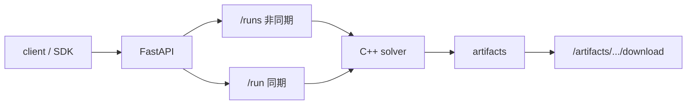

# API Reference

このドキュメントは `app/main.py` の FastAPI エンドポイント仕様をまとめたものです。



## Base URL

- 例: `https://api.example.com`（**公開運用は TLS 終端を前提**）
- ローカル開発例: `http://127.0.0.1:8000`

## 認証

- ヘッダ: `X-API-Key`
- 有効化: 次のいずれかが非空のとき
  - `VTSIMNX_API_KEY`（単一）
  - `VTSIMNX_API_KEYS`（カンマ/改行区切り。`id:secret` 形式可）
  - `VTSIMNX_API_KEYS_JSON`（`[{"id":"ops","key":"...","revoked":false}]`）
- 未設定時は認証なし（ローカル開発用）
- 照合は定数時間比較。失効キー（`revoked: true`）は拒否
- キー秘密はログに出ません（監査ログは `key_id` のみ）
- レート制限: `VTSIMNX_RATE_LIMIT_PER_MIN`（既定 120、0 で無効）
- 認証不要: `/ping`, `/health/live`, `/health/ready`, `/version`

## エンドポイント一覧

| Method | Path | 用途 |
|---|---|---|
| GET | `/health/live` | プロセス生存（liveness） |
| GET | `/health/ready` | solver / work / 依存の準備（readiness） |
| GET | `/version` | API / client / solver / schema バージョン |
| GET | `/ping` | 後方互換ヘルス（live と同等） |
| POST | `/runs` | 非同期ジョブ投入（推奨） |
| GET | `/runs/{run_id}` | ジョブ状態・進捗 |
| GET | `/runs/{run_id}/result` | 完了時の結果取得 |
| DELETE | `/runs/{run_id}` | ジョブキャンセル |
| POST | `/run` | 同期シミュレーション（互換・デバッグ用） |
| GET | `/artifacts/{artifact_dir}/manifest` | 実行結果メタ情報取得 |
| GET | `/artifacts/{artifact_dir}/files` | ダウンロード可能キー一覧取得 |
| GET | `/artifacts/{artifact_dir}/download/{key}` | artifact ファイル実体ダウンロード |

ジョブ表はプロセス内メモリ上に保持します。**uvicorn は `workers=1` を推奨**します（マルチワーカーではジョブ状態を共有しません）。並列度は `VTSIMNX_MAX_WORKERS`（既定 1）で制御します。

### Artifact 保持ポリシー

| 環境変数 | 既定 | 意味 |
|---|---|---|
| `VTSIMNX_ARTIFACT_TTL_SEC` | 604800（7日） | 成果物 TTL（0 で無効） |
| `VTSIMNX_ARTIFACT_MAX_BYTES_PER_RUN` | 2GiB | run あたり上限（0 で無効）。超過時は巨大結果を削除しログ/manifest/error.json のみ残す |
| `VTSIMNX_ARTIFACT_MAX_TOTAL_BYTES` | 50GiB | work 全体上限（0 で無効） |
| `VTSIMNX_ARTIFACT_CLEANUP_MIN_INTERVAL_SEC` | 300 | 稼働中 cleanup の最短間隔（run 完了後に debounce 実行） |
| `VTSIMNX_ARTIFACT_STORE` | `local` | 保存先（現状 local のみ。抽象化済み） |

起動/終了時に加え、**run 完了後**にも TTL・全体上限に基づき掃除します（最短間隔で debounce）。実行中 run の成果物は削除対象外です。認証有効時は成果物に `owner_key_id` が付き、他キーからの取得は 403 になります。

### ジョブレコード保持

| 環境変数 | 既定 | 意味 |
|---|---|---|
| `VTSIMNX_JOB_TTL_SEC` | 86400（24h） | 完了ジョブのメモリ保持 TTL（0 で無効） |
| `VTSIMNX_MAX_JOB_RECORDS` | 1000 | ジョブレコード上限（0 で無効）。超過時は完了済みを古い順に削除 |

solver が `status=error` / `error` を返した場合、ジョブ API 上は **`failed`** になります（`succeeded` にはしません）。

---

## GET /health/live

### Response 200

```json
{"status":"ok"}
```

## GET /health/ready

### Response 200 / 503

```json
{
  "status": "ok",
  "checks": {
    "solver_binary": {"ok": true, "path": ".../build/vtsimnx_solver"},
    "work_dir": {"ok": true, "path": ".../work"},
    "python:fastapi": {"ok": true}
  }
}
```

## GET /version

`api_version` / `client_version` は `pyproject.toml` の `project.version` を正本とします（`engine/app/versioning.py`）。

```json
{
  "api_version": "<pyproject project.version>",
  "client_version": "<installed or same as api_version>",
  "solver": {"path": "...", "present": true},
  "schema_format_version": 5
}
```

## GET /ping

### Response 200

```json
{"status":"ok"}
```

---

## POST /runs

非同期ジョブを投入し、即時に `run_id` を返します。同一入力（canonical JSON の sha256）が `queued` / `running` の既存ジョブと一致する場合は、その `run_id` を **200** で返します。

### Request Body

`POST /run` と同じ（`config` / `debug` / `add_*`）。

### Response 202（新規） / 200（重複）

```json
{
  "run_id": "a1b2c3...",
  "status": "queued",
  "input_hash": "sha256hex..."
}
```

## GET /runs/{run_id}

### Response 200

```json
{
  "run_id": "a1b2c3...",
  "status": "running",
  "input_hash": "...",
  "created_at": "...",
  "started_at": "...",
  "finished_at": null,
  "progress": {"stage": "solver", "message": "running solver"},
  "artifact_dir": null,
  "error": null
}
```

`status`: `queued` | `running` | `succeeded` | `failed` | `cancelled`

## GET /runs/{run_id}/result

完了時のみ `POST /run` と同じ `SimulationResponse` を返します。未完了は **409**。

## DELETE /runs/{run_id}

`queued` は即キャンセル。`running` はキャンセルフラグを立て、可能なら solver 子プロセスを terminate します。

---

## POST /run

builder 入力 (`config`) を受け取り、solver 実行結果を**同期**で返します（互換 API。長時間計算は `POST /runs` を推奨）。

### Request Body

```json
{
  "config": {
    "simulation": {
      "index": {
        "start": "2025-01-01T00:00:00Z",
        "end": "2025-01-01T01:00:00Z",
        "timestep": 60,
        "length": 60
      }
    },
    "nodes": [{"key": "N1"}],
    "ventilation_branches": [],
    "thermal_branches": []
  },
  "unknown_keys": "strip",
  "debug": false,
  "debug_verbosity": 2,
  "add_surface": null,
  "add_aircon": null,
  "add_capacity": null,
  "add_moisture_capacity": null,
  "add_surface_solar": null,
  "add_surface_nocturnal": null,
  "add_surface_radiation": null,
  "add_surface_radiation_exclude_glass": null
}
```

- `config` (required): builder 入力 JSON（OpenAPI 上は `RawSimConfig`。詳細フィールドは `docs/builder_json.md`）
- `unknown_keys` (optional, default `"strip"`): 未知フィールドの扱い
  - `"strip"`: 削除して `warning_details` に `unknown_field_stripped` を載せる（互換）
  - `"error"`: **422** で拒否（実行しない）
- `debug` (optional, default `false`): ログ冗長度制御をデバッグ寄りにする
- `debug_verbosity` (optional, default `2`): `debug=true` 時の最小 verbosity
- `add_*` 系 (optional): builder の各展開処理を API から上書き制御

### Response 200

```json
{
  "result": {
    "artifact_dir": "run_20260312_abcdef12",
    "result_files": {
      "schema": "schema.json"
    },
    "log_file": "solver.log"
  },
  "warnings": [],
  "warning_details": []
}
```

### Error Response

すべてのエラーは次の形に統一されます。

```json
{
  "error": {
    "code": "invalid_config",
    "message": "...",
    "path": ["nodes", 0, "key"],
    "hint": "...",
    "run_id": "..."
  }
}
```

`path` / `hint` / `run_id` は省略されることがあります。

#### 代表的な `error.code`

| code | HTTP | 意味 |
|---|---|---|
| `unauthorized` | 401 | API キー不正・欠落 |
| `rate_limited` | 429 | レート制限超過 |
| `invalid_gzip` / `gzip_too_large` / `body_too_large` | 400/413 | gzip リクエスト不正 |
| `validation_error` / `unknown_field` | 422 | Pydantic / 未知キー |
| `invalid_config` / `invalid_config_missing_field` | 400 | builder 入力不正 |
| `artifact_not_found` / `manifest_not_found` / `file_not_found` | 404 | 成果物欠落 |
| `forbidden_artifact` / `forbidden_run` | 403 | 所有者キー不一致 |
| `not_ready` / `cancelled` | 409 | 非同期ジョブ未完了/取消 |
| `internal_error` / `solver_binary_not_found` / `solver_timeout` / `solver_execution_failed` | 500 | 実行時エラー |

#### 422 Unprocessable Entity（未知フィールド・`unknown_keys=error`）

```json
{
  "error": {
    "code": "unknown_field",
    "message": "...",
    "path": ["config", "nodes[0]", "typo"],
    "hint": "...",
    "details": [ { "type": "unknown_field", "loc": ["config", "nodes[0]", "typo"], "msg": "..." } ]
  }
}
```

#### 400 Bad Request（入力不正）

```json
{
  "error": {
    "code": "invalid_config",
    "message": "..."
  }
}
```

#### 500 Internal Server Error（実行時エラー）

```json
{
  "error": {
    "code": "internal_error",
    "message": "...",
    "run_id": "..."
  }
}
```

---

## GET /artifacts/{artifact_dir}/manifest

artifact ディレクトリ配下の `manifest.json` を返します。

### Response 200（例）

```json
{
  "created_at": "2026-03-12T00:00:00+00:00",
  "output": {
    "artifact_dir": "run_20260312_abcdef12",
    "result_files": {
      "schema": "schema.json"
    },
    "log_file": "solver.log",
    "builder_log_file": "builder.log"
  },
  "result_files": {
    "schema": "schema.json"
  },
  "files": {
    "schema": "schema.json",
    "log": "solver.log",
    "builder_log": "builder.log",
    "manifest": "manifest.json"
  }
}
```

---

## GET /artifacts/{artifact_dir}/files

`download/{key}` に渡せるキー一覧を返します。

### Response 200（例）

```json
{
  "artifact_dir": "run_20260312_abcdef12",
  "keys": ["schema", "log", "builder_log", "manifest"]
}
```

---

## GET /artifacts/{artifact_dir}/download/{key}

キーで指定したファイルを返します。  
`key` は `/artifacts/{artifact_dir}/files` で取得したもののみ利用してください。

### 例

```bash
curl -L -o schema.json http://127.0.0.1:8000/artifacts/<artifact_dir>/download/schema
curl -L -o solver.log  http://127.0.0.1:8000/artifacts/<artifact_dir>/download/log
```

---

## 補足

- `Content-Encoding: gzip` のリクエストボディを受け付けます。
- `artifact_dir` および配布ファイルはパストラバーサル対策済みです。
- 成果物取得は `/artifacts/...` に一本化しています。`/work` の静的公開は行いません。
- OpenAPI は起動後に `/docs`（Swagger UI）と `/openapi.json` でも参照できます。
