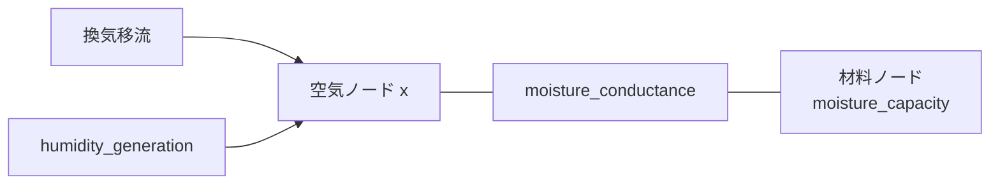
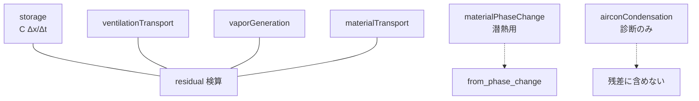
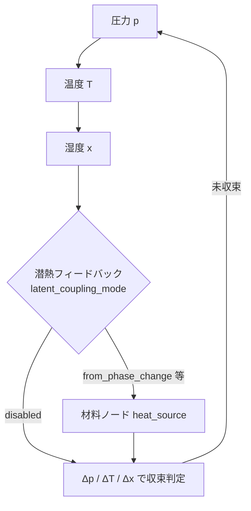

# 湿気回路網（Phase1: 線形RC）

Phase1 では、既存の移流ベース湿度計算に加えて、線形RC型の湿気回路網を導入します。

> 方針: 現段階の完成範囲は「Phase1（線形RC）」までとし、非線形HAMは将来課題として扱います。  
> 計算ループ上の位置づけは [`simulation_loops.md`](simulation_loops.md) を参照してください。

## 目的

- 壁体/材料側の湿気容量を持つノードを追加できるようにする
- ノード間の湿気伝達を `moisture_conductance` で表現する
- 既存入力との後方互換を維持する（新フィールド未使用時は既存挙動）

## 入力フィールド（追加）

### ノード (`nodes[]`)

- `moisture_capacity` (number, optional)
  - ノードの湿気容量
  - **有限かつ `> 0` であること**（負値・0・NaN・inf はエラー）
  - `>0` のとき、湿度更新で容量項として使われる
  - 既定単位: `[J/(kg/kg')]`
- `moisture_capacity_unit` (string, optional)
  - `moisture_capacity` の入力単位を指定
  - `moisture_capacity` 無しで unit のみの指定はエラー（`add_moisture_capacity=true` 時）
  - 対応:
    - `"J/(kg/kg')"`（既定、builder で内部単位へ変換）
    - `"kg/(kg/kg)"`（内部単位としてそのまま使用）
  - `"J/(kg/kg')"` 指定時は `moisture_capacity / Lv` で換算（`Lv=2.5e6 [J/kg]`）
- `w` (number または array, optional)
  - 材料側含湿状態の時系列入力（内部状態 `current_w`）
  - 湿度更新は `x` を主状態として計算し、`current_w` は同値で追従

### 熱ブランチ (`thermal_branches[]`)

- `moisture_conductance` (number, optional)
  - source/target 間の湿気伝達コンダクタンス `[kg/s]`
  - 湿度方程式で双方向結合として扱う
  - 既存の温度計算への影響を避けるため、Phase1 では `conductance` と独立に扱う

#### 記述規約（混乱防止）

- 入力JSON上の表記は、熱ブランチと同様に `source -> target` で統一してください。
- ただし `moisture_conductance` は実装上、方程式組み立て時に双方向リンクとして扱われます。
- つまり「表記方向」は主に可読性・命名規約のためで、物理モデルとしては双方向伝達です。

## builder 拡張（任意）

- `nodes[].moisture_capacity` を持つノードに対して、以下を自動生成:
  - 容量ノード: `<key>_mx`（`calc_x=true`）
  - 湿気伝達枝: `<key>_mx-><key>` (`moisture_conductance = moisture_capacity / timestep`)
  - 元ノードからも `moisture_capacity` を除去し、`calc_x=true` を立てる
- 空調ノードは `supplyX` / パススルー湿度の**固定境界**のため `calc_x=false` のまま（設定ノードの `calc_x` を空調へ伝播しない）。停止中・非冷房の空調に直接接続する吸込・吹出両側の枝を湿度移流から除外し、冷房 ON のみ両側の枝を含める
- builder オプション:
  - `builder.add_moisture_capacity`（既定: `true`）
    - `true`: 上記の材料側ノード展開を行う
    - `false`: 湿気容量を**無効化**する
      - `moisture_capacity` / `moisture_capacity_unit` を除去する（どちらか一方だけでも両方除去）
      - `<key>_mx` は生成しない
      - 元ノードへ `calc_x` を強制しない
      - solver へ室ノードの `moisture_capacity` を直接渡す「別物理モデル」にはしない

手書きで材料ノードへ `moisture_capacity` を載せたい場合は、builder 展開後の solver JSON を直接編集するか、`add_moisture_capacity=false` ではなく明示的に `<key>_mx` ノードと枝を書いてください。

## 互換性

- 既存 JSON（新フィールドなし）: 従来の湿度計算結果を維持
- 新フィールドあり: 移流 + 生成項 + 湿気回路網項を同時に陰的更新

## スコープ（完成範囲と将来課題）

### 現在の完成範囲（Phase1）

- 線形RCとしての湿気計算
  - 換気移流（flow_rate）
  - 発湿（humidity_generation）
  - 湿気伝達（moisture_conductance）
  - 湿気容量（moisture_capacity）
- 圧力・熱との連成ループへの統合
- 既存入力との後方互換（新フィールド未使用時）

### 将来課題（Phase2以降）

- 非線形HAM
  - 吸着等温線（非線形・ヒステリシス）
  - 温湿度依存の材料物性
  - 液水移動、結露・再蒸発の詳細扱い
- 多層壁の高忠実度湿気移動モデル

## Phase1.5: 水分収支診断と材料相変化潜熱

連成ループ構造はそのままに、湿気項の意味別整理と潜熱連成を追加します。

### 水分収支内訳（診断）

求解後にノードごとの `[kg/s]` 内訳を評価します（ソルバ数値には影響しません）。

- `ventilationTransport`: 換気による正味水蒸気流入
- `vaporGeneration`: `humidity_generation`
- `materialTransport`: 全 `moistureLinks`（全 `moisture_transfer_type`）の正味水蒸気流入。湿度方程式と一致し、**残差検算に使用**
- `materialPhaseChange`: `moisture_transfer_type=phase_change` のみ。潜熱 `from_phase_change` に使用
- `airconCondensation`: 空調ノード除湿の診断項（吹出境界に織込み済みのため残差には含めない）
- `storage`: \(C(x^{n+1}-x^n)/\Delta t\)
- `residual`: `storage - (vent+gen+materialTransport)`（方程式適合の検算）

符号規約（相変化）:

- 正の \(\dot m_\mathrm{phase}\): 材料 → 空気（蒸発）
- 負: 空気 → 材料（凝縮）
- 材料ノードでは \(\dot m_\mathrm{phase} = -\texttt{materialPhaseChange}\)

換気枝の任意フィールド `humidity_source_type`（既定 `vapor_injection`）:

- `vapor_injection` / `room_evaporation` / `external_source`
- Phase1.5 では診断分類のみ。`room_evaporation` の室内潜熱連成は将来課題

### 潜熱連成モード

`simulation.coupling.latent_coupling_mode`:

| 値 | 意味 |
|----|------|
| `disabled` (0, 既定) | 潜熱フィードバックなし |
| `from_humidity_change` (1) | **非推奨・将来削除予定**。\(Q=-\rho V L \Delta x/\Delta t\)（換気を相変化と誤認し得る）。パーサは WARN を出す |
| `from_phase_change` (2) | 推奨。材料ノードのみ \(Q=-L_v \dot m_\mathrm{phase}\) |

`from_phase_change` では空気ノード・換気・発湿・空調は熱源に載せません。熱の載せ先は `moisture_capacity > 0` の材料ノードです。

有効条件: `calc_flag.x` かつ `calc_flag.t` かつ `moisture_enabled=true`。

### 換気エンタルピー（湿り空気エネルギー収支）

`simulation.coupling.moist_enthalpy_enabled`（既定 `false`）:

- ON 時、換気移流と空気ノード capacity 蓄積を \(h(T,x)=(c_{pa}+x c_{pv})T+x L_v\) の収支で解く（未知数は温度 \(T\)、連成中の \(x\) は既知）
- 空気蓄積: `subtype=air_capacity` は \(\rho V/\Delta t\) を体積・dt から直接計算。レガシー `capacity`+`v>0` は乾き conductance（家具等）を維持し、水蒸気分のみ \(\rho V\) を加算
- builder は `v>0` のとき空気分を `air_capacity`、残りを `capacity` に分離。`thermal_mass < ρ·cp·V` は入力エラー（切り詰めない）
- 空調処理熱（能力・COP・DUCT 風量連動の全熱）も \(\dot m |h_\mathrm{in}-h_\mathrm{out}|\) に統一（顕熱/潜熱は acmodel 互換のため分解）
- 吹出絶対湿度 `supplyX` を空調ノード `current_x` に反映し、除湿量 \(\dot m(x_\mathrm{in}-x_\mathrm{supply})\) を `airconCondensation` 診断へ記録（湿気移流境界と能力計算を一致）
- 空調ノードは湿度の**固定境界**（`calc_x=false`）。湿度ソルバは `type=aircon` を未知数から除外する
- 停止中または `current_mode != "COOLING"` の空調に直接接続する吸込・吹出両側の換気枝は**湿度移流から除外**する。換気・熱の風量は維持する。異室間の湿気混合も省く近似であり、`AUTO` も除外される点に注意する
- 冷房 ON（`current_mode=COOLING`）は還気枝を残し、吹出を固定境界として除湿する
- 各外側ループの物理求解前に、停止中・非冷房、または非有限値もしくは `1e-4 kg/kg(DA)` 以下の空調 `current_x` を吸込湿度へ同期する
- 再計算判定には床 `max(連成湿度tol, 1e-4 kg/kg(DA))` を使う（微小ドリフトで外側ループが数十回回るのを防ぐ。`current_x` 自体は常に最新値へ更新）
- 吹出湿度の変化が上記閾値を超えた場合、外側ループで再計算し、**同一タイムステップの湿度・エンタルピー連成へ反映**する。閾値以下では境界更新だけを理由に再計算しない
- 必須: `calc_flag.x` かつ `calc_flag.t` かつ `moisture_enabled=true`（非連成では当該ステップの更新後 \(x\) を熱へ戻せない）
- `from_humidity_change` との併用は禁止（二重計上）
- `from_phase_change` との併用も当面禁止（材料側のみ \(Q=-L\dot m\) だと空気側の対向項がなくエネルギーが片側欠損する）
- 湿気枝の `moisture_transfer_type`（未指定は `phase_change`）:
  - `phase_change`: 相変化。潜熱診断・`from_phase_change` の対象
  - `vapor_diffusion`: 現状は湿度方程式上 `phase_change` と同じ \(k(x_j-x_i)\)。潜熱診断には含めない（分類用）
  - `liquid_transport` / `sorption`: **将来用の分類値**。液水ポテンシャル・含水率平衡は未実装。現状も同じ \(k\Delta x\) で解くのみ

### 将来（Phase1.5 以降）

- 相変化潜熱の材料↔空気 対向項（同一基準エンタルピー）
- `room_evaporation` 発湿の室内潜熱
- `from_humidity_change` の削除
- `from_phase_change` + moist enthalpy の併用解禁（空気側対向項）
- `vapor_diffusion` / `liquid_transport` / `sorption` 固有の移動式
## 圧力・熱・湿気の連成

Phase1 実装では、1タイムステップの内側反復で次のように連成します。

- 順序: `air (pressure) → thermal (temperature) → moisture (humidity x)`
- 収束判定: 有効フラグに応じ **圧力 + 温度 + 湿気 (x)**（潜熱 ON 時は潜熱変化も）
- 潜熱: `latent_coupling_mode` が有効なとき、材料相変化などに応じて熱ネットワークの `heat_source` へ反映（詳細は上節）
- 反復は有効状態量が2つ以上ある場合に有効化（例: `p+t`, `t+x`, `p+x`）

ループ全体の図は [`simulation_loops.md`](simulation_loops.md) の「内側連成」を参照。

### 既定ON / 切替

- 既定: `simulation.coupling.moisture_enabled = true`
- 連成OFF（従来互換に近い挙動）:
  - `simulation.coupling.moisture_enabled = false`
  - この場合、湿気更新は外側ループで1回のみ実行

### 調整パラメータ（任意）

- `simulation.tolerance.coupling_humidity`:
  - 湿気収束許容誤差（未指定時は `simulation.tolerance.convergence`）
- `simulation.coupling.humidity_relaxation`:
  - 湿気反復の緩和係数 `(0,1]`（既定 `1.0`）
- `simulation.coupling.latent_relaxation`:
  - 潜熱フィードバック緩和係数 `(0,1]`（既定 `0.5`）
- `simulation.coupling.humidity_solver_tolerance`:
  - 湿気内部ソルバ（直接法）の相対残差許容誤差（既定 `1e-9`）
  - 判定は `||Ax-b|| / ||b||`（`||b||=0` の場合は `||Ax-b||`）

### 設定互換（移行中）

- `simulation.coupling.humidity_solver_max_iter` は後方互換のため受理しますが、直接法では使用しません（ログに WARN を出力）。

## 実装レイヤ（C-3 進行中）

- 正規実装は `core/humidity` に配置
  - `core/humidity/humidity_solver.*`
  - `core/humidity/humidity_coupling.*`
- `transport` 層の湿気ソルバ入口は廃止し、呼び出しは `core/humidity/humidity_solver.*` に統一
- `core/humidity/humidity_solver` は湿気反復の収束情報（反復回数・残差）を返し、連成ログ診断に利用

