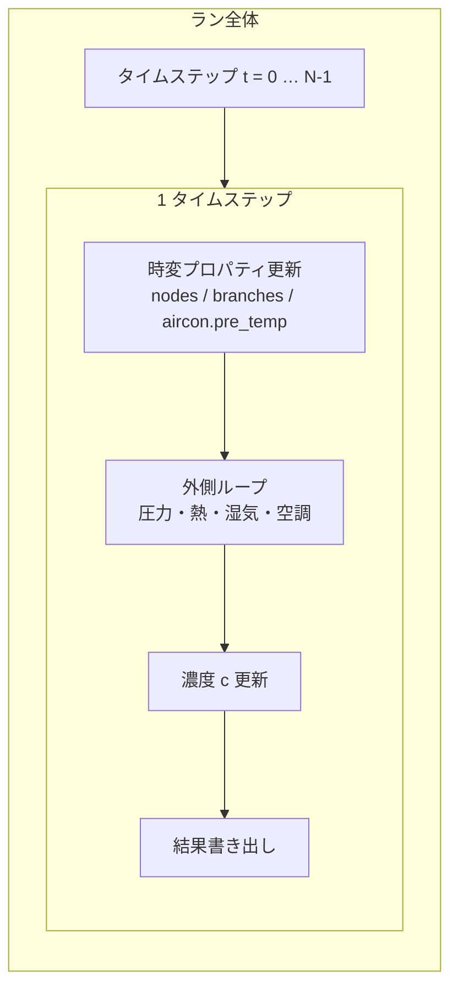
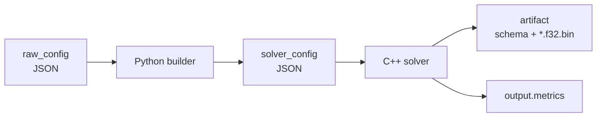
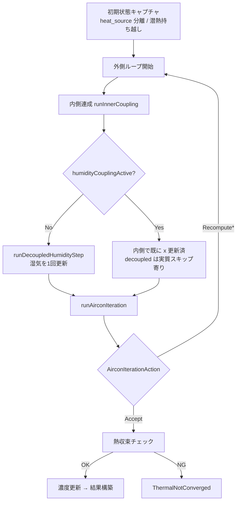
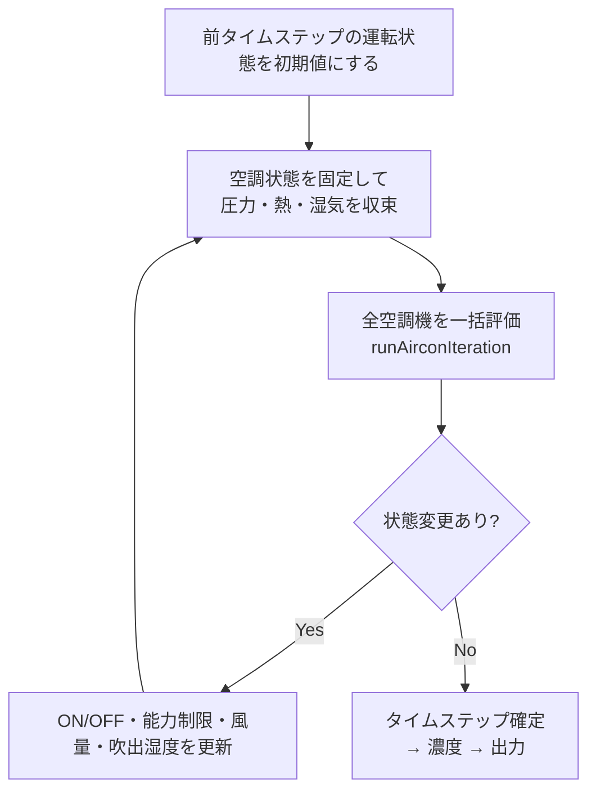
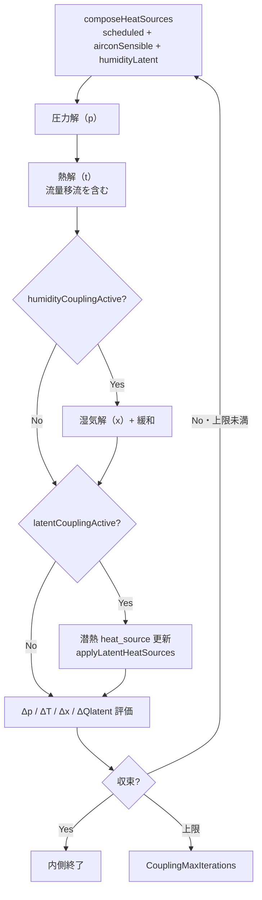
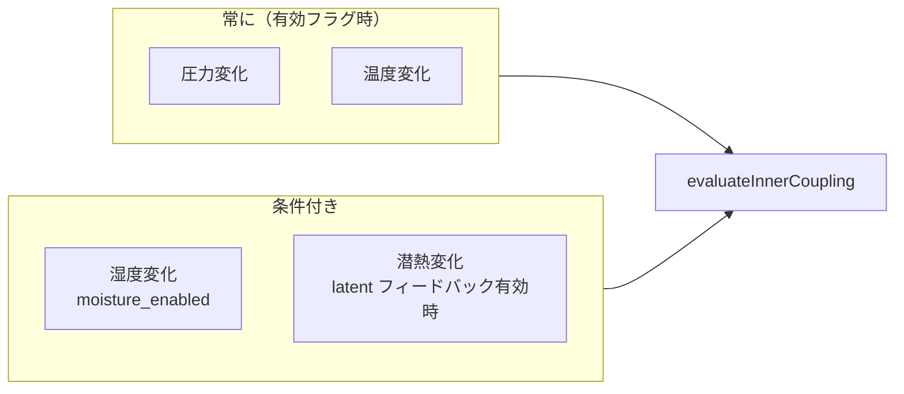
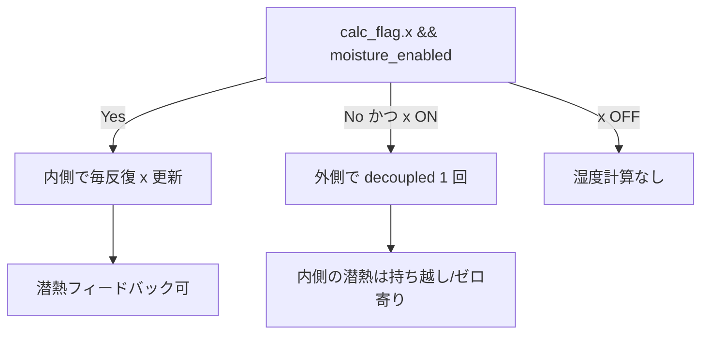
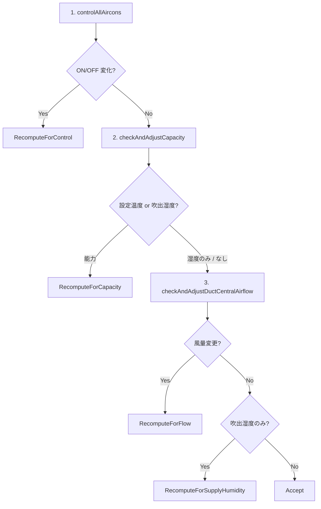
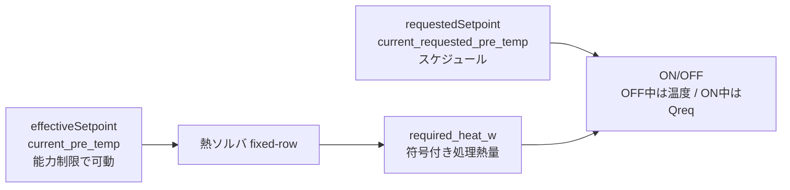
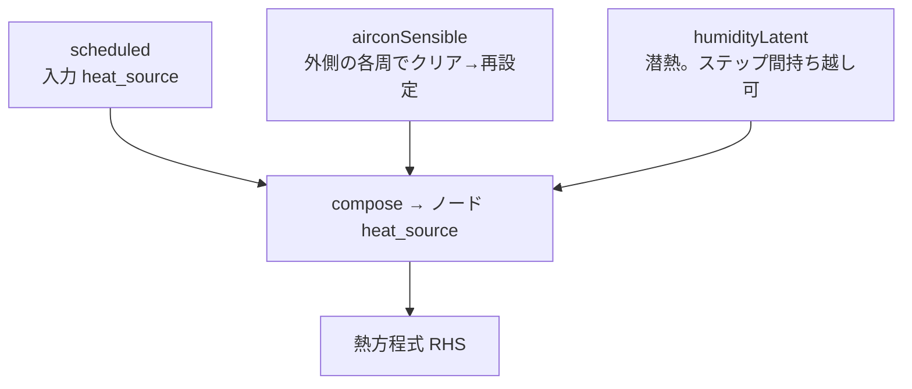

# 計算ループ構成（図解）

実装の正本は `engine/solver/simulation_runner.cpp` とその周辺です。  
この文書は **入れ子になったループ** を図で把握するためのガイドです。文章の計算順一覧は [`simulation_overview.md`](simulation_overview.md)、空調詳細は [`aircon_control_overview.md`](aircon_control_overview.md) を参照してください。

---

## 1. レイヤの入れ子（全体）

VTSimNX の計算は次の入れ子です。

| レイヤ | 実装の入口 | 何が変わるまで回るか |
|---|---|---|
| ラン | `vtsimnx_app` のステップループ | 全時刻 |
| 外側ループ | `runSimulation()` | 空調状態（ON/OFF・能力・風量・吹出湿度）が安定 |
| 内側連成 | `runInnerCoupling()` | 圧力・温度（＋条件により湿度・潜熱）が収束 |
| 空調評価 | `runAirconIteration()` | 1 回評価。変化があれば外側をやり直し |

---

## 2. パイプライン（入力 → 出力）

builder の役割は [`builder_json.md`](builder_json.md)、フラグは `simulation.calc_flag`（`p` / `t` / `x` / `c`）。

---

## 3. 1 タイムステップの骨格

`runSimulation()` の外側構造です。

要点:

- **湿度の内側連成 ON**（`coupling.moisture_enabled` 既定 true）のとき、湿気は内側反復の収束判定に入ります。
- **湿度の内側連成 OFF** のとき、湿気は外側ループ内で `runDecoupledHumidityStep` により 1 回更新します。
- **濃度 `c`** は外側 Accept 後に 1 回だけ更新します（空調判定には使いません）。

---

## 4. 外側ループ（空調制御ループ）

空調の特徴として、`set_node`（制御対象）と吸込・吹出空間を分離した**遠隔 set**（エアコン未設置室の温度制御）をサポートします。詳細は [`aircon_control_overview.md`](aircon_control_overview.md) 冒頭。

上限: `effectiveMaxAirconControlIterations`（未指定時は連成上限と同系のフォールバック）。

再計算理由の優先順位（ビットフラグ `AirconRecomputeReason`）:

| アクション | 典型トリガ |
|---|---|
| `RecomputeForControl` | ON/OFF 変化 |
| `RecomputeForCapacity` | 実効設定温度の能力制限補正 |
| `RecomputeForFlow` | DUCT_CENTRAL の `fixed_flow` 補正（処理熱確定後） |
| `RecomputeForSupplyHumidity` | 吹出絶対湿度のみ変化 |
| `Accept` | 上記なし |

メトリクスの読み方は [`aircon_control_overview.md`](aircon_control_overview.md) の「今後の方針」節を参照。

---

## 5. 内側連成（圧力・熱・湿気）

`runInnerCoupling()` の 1 反復です。

### 5.1 何が収束判定に入るか

- 最小反復: 通常 1。空調 ON/OFF・mode 署名が変わった直後の外側 1 周目は **最低 2 回**（ウォームスタート無効化）。
- 上限: `effectiveMaxCouplingIterations`。

### 5.2 湿度・潜熱の分岐（概念）

湿気回路網の詳細は [`moisture_network_phase1.md`](moisture_network_phase1.md)。

---

## 6. 空調評価の 3 段階

`runAirconIteration()` は早期 return します（後段を飛ばす）。  
処理熱（能力制限）を先に確定し、DUCT 風量補正は最後に行う（同時更新による振動を避ける）。  
能力制限中・設定未達・ON+set_node 固定温度中の風量比は計測コイル熱ではなく `Q_max` 基準（`V∝Q_meas∝V` の 0 縮小を防ぐ）。

各段階は `AirconStateProposal` を積み上げ、理由を OR 集約します。

設定温度の二系統:

ON 中かつ `set_node` が実効設定近傍にあるときだけ `required_heat_w` を使います。  
室温が大きく外れている解では温度バンドへフォールバックし、ON/OFF 振動を防ぎます。能力探索が最終検証後も上限を満たせない場合は Accept せず例外終了します。

`required_heat_w` は通常、set 熱収支から空調寄与を除いて求めます。  
`set ≠ in/out`（遠隔 set）では dual-row 後に set 収支が ≈0 となるため、コイル処理熱量へフォールバックします。

---

## 7. 熱源の分離（外側・内側で共有）

外側ループは熱源を役割別に持ちます。

- 外側ループの **周の先頭**で `airconSensible` をゼロ化してから再合成します。
- `humidityLatent` は潜熱連成 ON のとき次ステップへ持ち越せます。
- 空調制御直前にノード `heat_source` をゼロ化する処理は行いません（正本は `SeparatedHeatSources`）。
---

## 8. コード対応表

| 図の箱 | 主なファイル |
|---|---|
| タイムステップ全体 | `simulation_runner.cpp` |
| 内側連成 | `simulation_inner_coupling.cpp` |
| 圧力+熱 1 回 | `simulation_coupled_step.cpp` |
| 収束判定 | `simulation_coupling_control.cpp` |
| 空調 3 段階 | `simulation_aircon_iteration.cpp` |
| ON/OFF・能力・風量 | `aircon/aircon_controller.cpp` ほか |
| メトリクス | `simulation_metrics.h` |

---

## 9. 関連ドキュメント

- [`simulation_overview.md`](simulation_overview.md) — 計算順の文章版
- [`aircon_control_overview.md`](aircon_control_overview.md) — 空調制御・メトリクス
- [`moisture_network_phase1.md`](moisture_network_phase1.md) — 湿気・潜熱
- [`theory_basics.md`](theory_basics.md) — 物理の全体像
