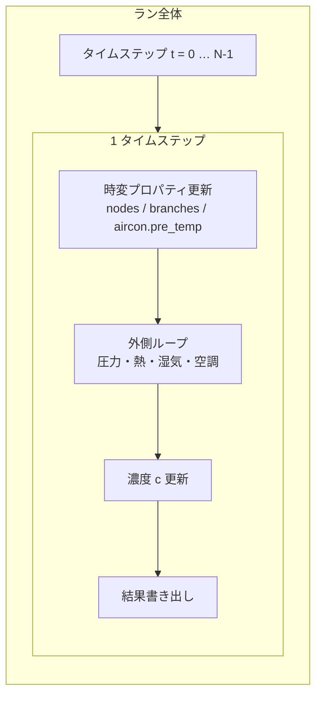
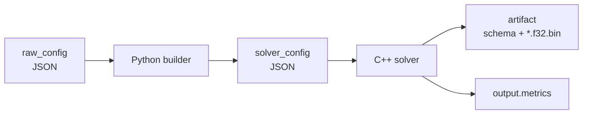
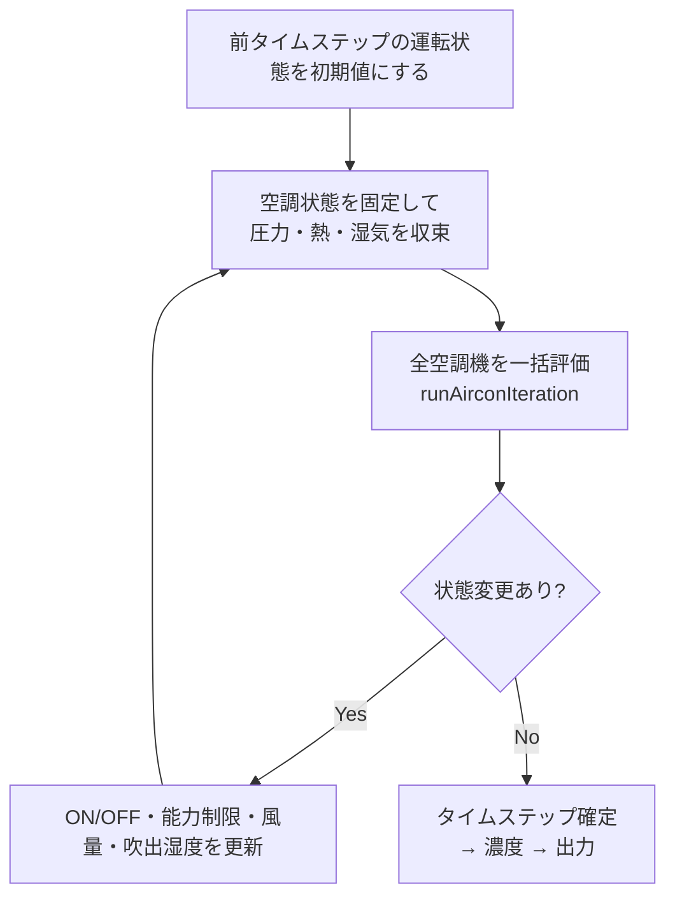
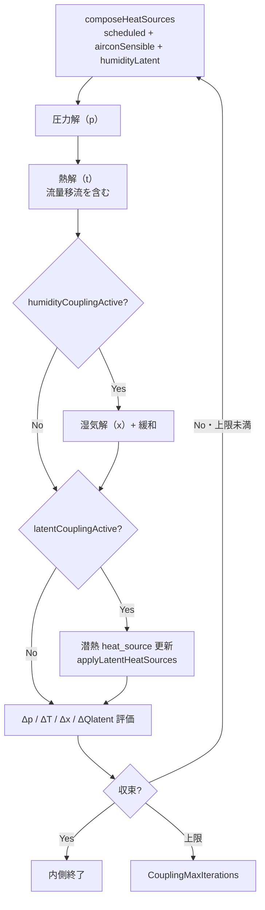
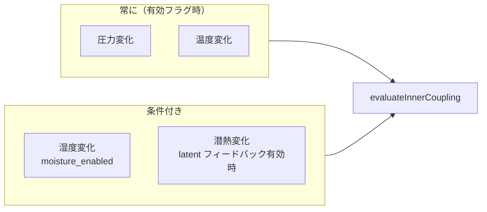
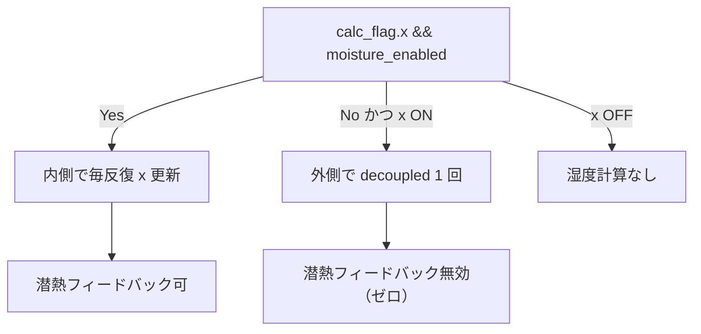
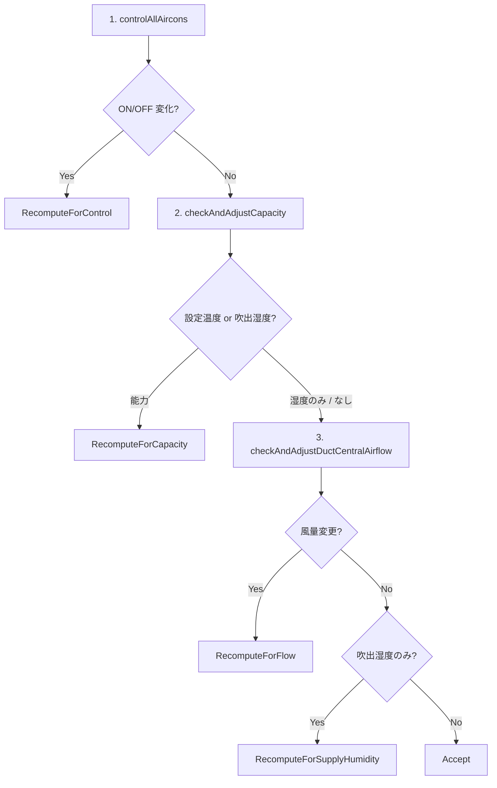
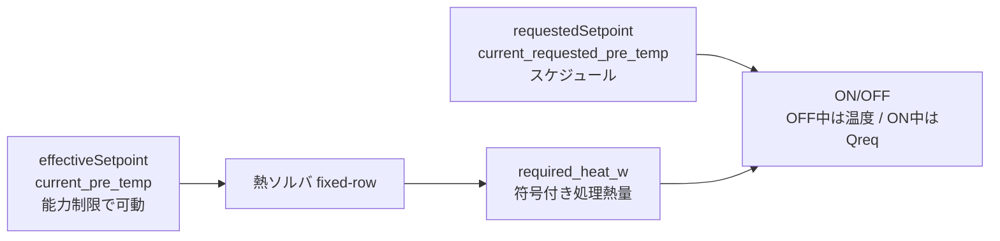
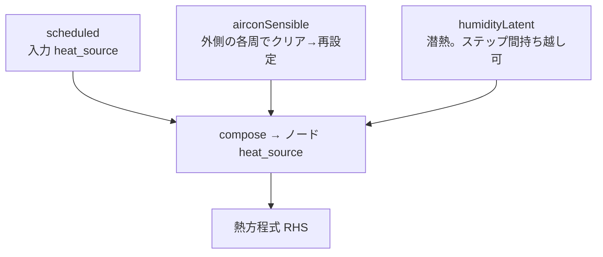

# 計算ループ構成（図解）

実装の正本は `engine/solver/simulation_runner.cpp` とその周辺です。  
この文書は **入れ子になったループ** を図で把握するためのガイドです。文章の計算順一覧は [`simulation_overview.md`](simulation_overview.md)、空調詳細は [`aircon_control_overview.md`](aircon_control_overview.md) を参照してください。

---

## 1. レイヤの入れ子（全体）

VTSimNX の計算は次の入れ子です。

| レイヤ | 実装の入口 | 何が変わるまで回るか |
|---|---|---|
| ラン | `vtsimnx_app` のステップループ | 全時刻 |
| 外側ループ | `runSimulation()` | 空調状態（ON/OFF・能力・風量・吹出湿度）が安定 |
| 内側連成 | `runInnerCoupling()` | 圧力・温度（＋条件により湿度・潜熱）が収束 |
| 空調評価 | `runAirconIteration()` | 1 回評価。変化があれば外側をやり直し |

---

## 2. パイプライン（入力 → 出力）

builder の役割は [`builder_json.md`](builder_json.md)、フラグは `simulation.calc_flag`（`p` / `t` / `x` / `c`）。

---

## 3. 1 タイムステップの骨格

`runSimulation()` の外側構造です。

要点:

- **`calc_flag.x=true` かつ `coupling.moisture_enabled=true`** のとき、湿気を内側で更新し、連成反復が必要な場合は湿度変化を収束判定に含めます。
- **`calc_flag.x=true` かつ `coupling.moisture_enabled=false`** のとき、`runDecoupledHumidityStep` は外側ループの各周で 1 回更新します。それ以外は即 return します。
- **濃度 `c`** は外側 Accept と熱収束確認の後、`calc_flag.c` が有効な場合に 1 回だけ更新します（空調判定には使いません）。

---

## 4. 外側ループ（空調制御ループ）

空調の特徴として、`set_node`（制御対象）と吸込・吹出空間を分離した**遠隔 set**（エアコン未設置室の温度制御）をサポートします。詳細は [`aircon_control_overview.md`](aircon_control_overview.md) 冒頭。

上限は `maxAirconControlIterations > 0` ならその値、それ以外は `maxInnerIterations` です（内部定数名）。`maxCouplingIterations` にはフォールバックしません。上限までに Accept しない場合は `AirconMaxIterations` で終了します。

再計算理由の優先順位（ビットフラグ `AirconRecomputeReason`）:

| アクション | 典型トリガ |
|---|---|
| `RecomputeForControl` | ON/OFF 変化 |
| `RecomputeForCapacity` | 実効設定温度の能力制限補正 |
| `RecomputeForFlow` | DUCT_CENTRAL の `fixed_flow` 補正（処理熱確定後） |
| `RecomputeForSupplyHumidity` | 吹出絶対湿度のみ変化 |
| `Accept` | 上記なし |

メトリクスの読み方は [`aircon_control_overview.md`](aircon_control_overview.md) の「今後の方針」節を参照。

---

## 5. 内側連成（圧力・熱・湿気）

`runInnerCoupling()` の 1 反復です。

### 5.1 何が収束判定に入るか

- 最小反復: 通常 1。空調 ON/OFF・mode 署名が変わった直後の外側 1 周目は **最低 2 回**（ウォームスタート無効化）。
- 上限: `maxCouplingIterations > 0` ならその値、それ以外は `maxInnerIterations`（内部定数名）。
- 例外: 圧力・温度・内側連成湿度の有効な状態量が 1 つ以下なら、最小反復数によらず 1 回で内側を終了します。ただし、初回の圧力未収束は先にエラー判定します。
- 連成収束は有効な各状態量について、最大絶対変化量が許容値未満（`Δp < pTol`, `ΔT < tTol`, `Δx < xTol`）であることを要求します。各許容値は対応する `coupling*Tolerance` が正ならその値、それ以外は `convergenceTolerance` です。
- 潜熱有効時はさらに `ΔQ <= max(0, absTol) + max(0, relTol) * max(|Q前反復|, |Q現反復|)` を要求します。Q の絶対値は全ノードの最大値、absTol/relTol は `couplingLatentAbsoluteToleranceW` / `couplingLatentRelativeTolerance` です。
- 上限回でも先に収束を判定し、未収束の場合のみ `CouplingMaxIterations` で終了します。

### 5.2 湿度・潜熱の分岐（概念）

#### 条件と状態の扱い（現行仕様）

ここでいう潜熱は `humidityLatent` による熱源フィードバックです。

| 条件 | 湿度更新 | 潜熱フィードバック |
|---|---|---|
| `calc_flag.x=false` | 更新なし | 無効 |
| `x=true`, `moisture_enabled=false` | 外側の各周で 1 回 | 無効。有効な潜熱モードとの併用はパーサが拒否 |
| `x=true`, `moisture_enabled=true`, `t=false` | 内側で更新 | 無効。有効な潜熱モードとの併用はパーサが拒否 |
| `x=true`, `moisture_enabled=true`, `t=true` | 内側で更新 | `latent_coupling_mode` が `from_humidity_change` または `from_phase_change` の場合に有効。`disabled` は無効 |

- 非連成の各更新前に、未知湿度ノード（`calc_x=true`）の x と材料含水量 w をタイムステップ開始時の値へ戻します。外側反復の回数だけ時間積分を重ねないためです。固定湿度境界（`calc_x=false`）は戻さず、空調吹出湿度などの外側反復による更新を保持します。
- 内側連成でも時間積分の基準 x は `initial.humidityX` に固定し、w を `initial.moistureW` に戻してから解きます。反復直前の湿度は緩和と変化量評価に使います。
- 潜熱有効時は、湿気更新・緩和後に潜熱を更新し、次の内側反復の熱計算へ渡します。非連成関数にも潜熱更新の分岐がありますが、現行の `latentCouplingActive` が `moisture_enabled=true` を要求するため到達しません。
- `from_humidity_change` は実験・非推奨のモードです。材料相変化の潜熱を扱う `from_phase_change` と同じ物理モデルとして扱わないでください。

条件の実装は [`simulation_inner_coupling.h`](../solver/simulation_inner_coupling.h)、更新順序は [`simulation_inner_coupling.cpp`](../solver/simulation_inner_coupling.cpp)、入力制約は [`sim_constants_parser.cpp`](../solver/parser/sim_constants_parser.cpp) を参照してください。
湿気回路網の詳細は [`moisture_network_phase1.md`](moisture_network_phase1.md)。

---

## 6. 空調評価の 3 段階

`runAirconIteration()` は早期 return します（後段を飛ばす）。  
処理熱（能力制限）を先に確定し、DUCT 風量補正は最後に行う（同時更新による振動を避ける）。  
能力制限中・設定未達の風量比は `Q_max`、設定維持中は `|required_heat_w|`（無いときは `Q_max`）。計測コイル熱は使わない（`V∝Q_meas∝V` の 0 縮小を防ぐ）。

各段階は `AirconStateProposal` を積み上げ、理由を OR 集約します。

設定温度の二系統:

ON 中かつ `set_node` が実効設定近傍にあるときだけ `required_heat_w` を使います。  
室温が大きく外れている解では温度バンドへフォールバックし、ON/OFF 振動を防ぎます。能力探索が最終検証後も上限を満たせない場合は Accept せず例外終了します。

`required_heat_w` は通常、set 熱収支から空調寄与を除いて求めます。  
`set ≠ in/out`（遠隔 set）では dual-row 後に set 収支が ≈0 となるため、コイル処理熱量へフォールバックします。

---

## 7. 熱源の分離（外側・内側で共有）

外側ループは熱源を役割別に持ちます。

- 外側ループの **周の先頭**で `airconSensible` をゼロ化してから再合成します。
- タイムステップ開始時、潜熱連成が有効で保存ベクトルと現ノード数が一致するときだけ、前ステップの `humidityLatent` を初期値に使います。それ以外はゼロです。外側収束後、有効なら保存し、無効なら保存値を消去します。
- 空調制御直前にノード `heat_source` をゼロ化する処理は行いません（正本は `SeparatedHeatSources`）。
---

## 8. コード対応表

| 図の箱 | 主なファイル |
|---|---|
| タイムステップ全体 | `simulation_runner.cpp` |
| 内側連成 | `simulation_inner_coupling.cpp` |
| 圧力+熱 1 回 | `simulation_coupled_step.cpp` |
| 収束判定 | `simulation_coupling_control.cpp` |
| 空調 3 段階 | `simulation_aircon_iteration.cpp` |
| ON/OFF・能力・風量 | `aircon/aircon_controller.cpp` ほか |
| メトリクス | `simulation_metrics.h` |

---

## 9. 関連ドキュメント

- [`simulation_overview.md`](simulation_overview.md) — 計算順の文章版
- [`aircon_control_overview.md`](aircon_control_overview.md) — 空調制御・メトリクス
- [`moisture_network_phase1.md`](moisture_network_phase1.md) — 湿気・潜熱
- [`theory_basics.md`](theory_basics.md) — 物理の全体像

仕様と既存テストの対応、および未確認の検証範囲は [仕様・実装・テスト対応表](specification_traceability.md) を参照してください。
