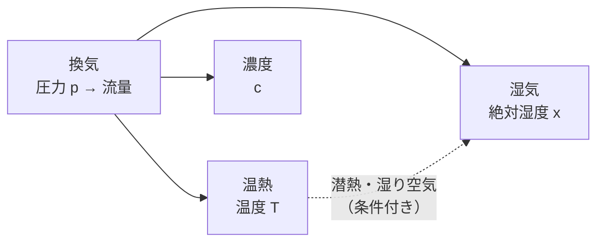
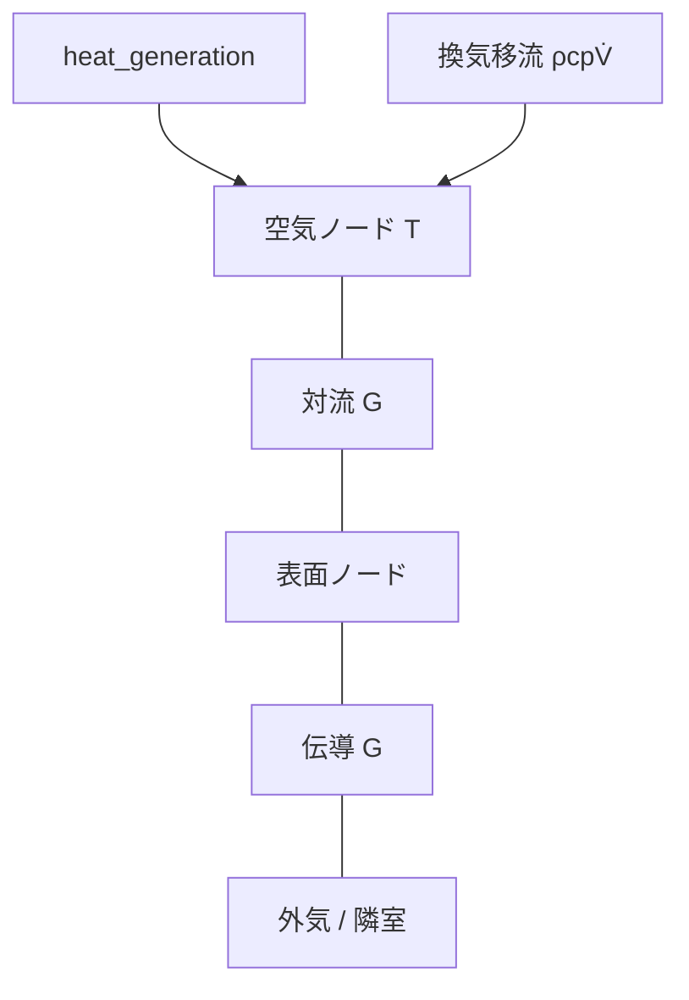
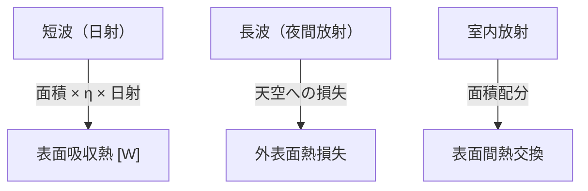
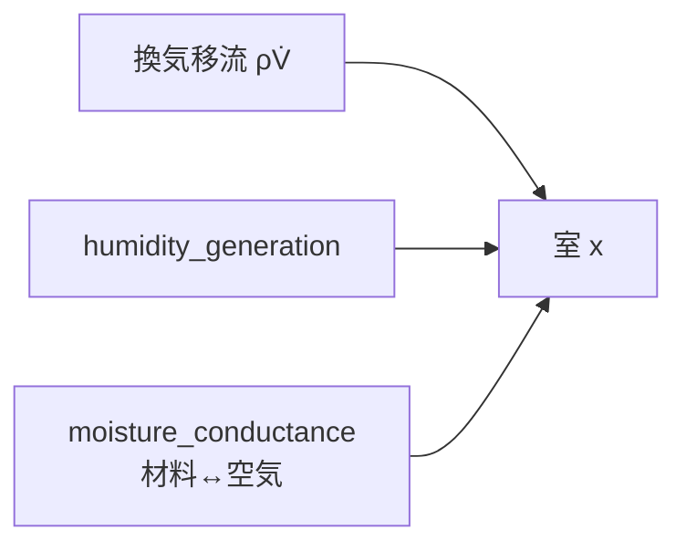

### 建築環境工学の基礎（VTSimNX向け）

このドキュメントは、VTSimNX で扱う主要な物理現象を、建築環境工学の観点から「実装につながる粒度」で整理したものです。  
利用者向けの背景説明は [`../../docs/building_environment_engineering_basics.md`](../../docs/building_environment_engineering_basics.md) を先に読んでください。  
実装仕様は [`builder_json.md`](builder_json.md)、計算順は [`simulation_overview.md`](simulation_overview.md)、ループ図解は [`simulation_loops.md`](simulation_loops.md) を参照してください。

---

### 1. 全体像：何を連成しているか

建築環境の時系列計算では、主に次を扱います。

| 現象 | 未知数の例 | 主な駆動 |
|---|---|---|
| 換気 | 圧力 \(p\) | 圧力差・ファン・固定流量 |
| 温熱 | 温度 \(T\) | 伝導・対流・放射・発熱・移流 |
| 湿気 | 絶対湿度 \(x\) | 移流・発湿・湿気コンダクタンス |
| 濃度 | 濃度 \(c\) | 移流・発塵・除去・沈着 |

VTSimNX の典型順は「内側で圧力・熱（＋湿気）を収束 → 空調判定 → 濃度」です。詳細は [`simulation_loops.md`](simulation_loops.md)。

---

### 2. 換気回路網の基礎

#### 2.1 基本の考え方

- 連続の式: 各ノードで「流入 − 流出 + 生成 = 0」になるよう圧力を解く
- 圧力差が流量を決め、流量は温度・湿度・濃度の移流項に効く

#### 2.2 実装上の対応

- 入力: `ventilation_branches`
- 代表モデル: `fixed_flow` / `simple_opening` / `gap` / `fan`
- 詳細: [`builder_json.md`](builder_json.md)

---

### 3. 熱回路網の基礎

#### 3.1 基本の考え方

熱回路網では、温度を電位、熱流を電流に対応させます。

- ノード熱収支: 「流入熱 − 流出熱 + 発熱 = 蓄熱変化」
- ブランチ: コンダクタンス \([W/K]\)、熱源 \([W]\)

#### 3.2 伝熱モード

| モード | 意味 |
|---|---|
| 伝導 | 壁体内部の熱移動 |
| 対流 | 空気と表面（表面熱伝達率） |
| 放射 | 室内表面間の長波、夜間放射など |

#### 3.3 実装上の対応

- `thermal_branches` が基本入力
- `surfaces` から RC または応答係数法の壁モデルを builder が展開
- 詳細: [`thermal_rc.md`](thermal_rc.md) / [`thermal_response_factor.md`](thermal_response_factor.md)

---

### 4. 日射・放射の基礎

- 短波: `eta`（吸収率）が効く
- 長波: `epsilon` など。室内放射はガラス除外オプションあり
- 実装: `surfaces` の `solar` / `nocturnal` / `night_radiation`（スカラー可）と builder オプション

---

### 5. 湿気・濃度の基礎

#### 5.1 湿気（絶対湿度）

#### 5.2 濃度（粒子/ガス）

- 移流に加え、発塵・除去効率 `eta`・沈着 `beta`
- 空調判定には使わず、外側 Accept 後に更新

湿気回路網の詳細は [`moisture_network_phase1.md`](moisture_network_phase1.md)。

---

### 6. モデル化で誤差が出やすいポイント

- 境界条件（外気温、日射、夜間放射の定義差）
- 物性値（λ、比熱、放射率、日射吸収率）
- U値の定義差（表面熱伝達率の内包有無）
- 放射配分（ガラスの扱い、面積配分）
- 時系列入力の整列（時刻の意味、配列長）。builder は長さ不一致をエラーにし、長さ1のみ broadcast する

---

### 7. 関連ドキュメント

| 文書 | 内容 |
|---|---|
| [`builder_json.md`](builder_json.md) | 入力仕様 |
| [`simulation_overview.md`](simulation_overview.md) | 計算順 |
| [`simulation_loops.md`](simulation_loops.md) | ループ図解 |
| [`thermal_rc.md`](thermal_rc.md) / [`thermal_response_factor.md`](thermal_response_factor.md) | 壁モデル |
| [`physics_math_notes.md`](physics_math_notes.md) | 符号・単位・離散化 |
| [`../../docs/building_environment_engineering_basics.md`](../../docs/building_environment_engineering_basics.md) | 利用者向け背景 |
